# EnglishHub — Database Design Proposal

Trạng thái: **Draft — chờ người dùng review database/ERD**. Ngày: 2026-09-14. Revision: 1.

Phạm vi: đầu ra thiết kế của **P0-01**, theo [PLAN revision 1.1](PLAN.md), [TASKS revision 2 — Approved](TASKS.md) và [REQUIREMENT.md](REQUIREMENT.md). Chỉ là đề xuất để người dùng tự thiết kế database. Chưa có entity, DbContext, migration, SQL script hay kiểm chứng schema trên SQL Server. **P0-01 chưa hoàn thành toàn bộ; Gate P0 chưa đạt/chưa được duyệt.** TASKS.md và source project không được cập nhật trong lượt này.

## 1. Thẩm quyền, phạm vi và cách đọc

Quyết định mới nhất của người dùng > baseline đã khóa tại PLAN/TASKS > REQUIREMENT cũ. Các mô tả cũ về Speaking, TTS, Meaning đơn, chưa có AI Writing/roadmap hoặc Fill chỉ là tương lai đã bị baseline mới thay thế; không dùng chúng để thiết kế bảng. Không có Course, Enrollment, Skill hierarchy, QuestionBank, bảng Resume, quota AI, hay điểm TOEIC 990.

Đề xuất **42 bảng vật lý**: 7 bảng Identity, 3 phân loại, 1 LearningItem, 2 Vocabulary, 1 Grammar, 2 Listening, 1 Reading, 2 Books, 4 Exercise/question, 5 Attempt (bao gồm AttemptSection), 4 Writing (bao gồm WritingTopic), 6 TOEIC authoring, 3 progress, 1 StoredFile. Timing/autosave dùng lại Attempt/AttemptSection/AttemptAnswer; Results là trạng thái và số liệu của Attempt, không cộng thêm bảng. Bốn bảng phụ Identity phục vụ framework có thể trống trong MVP; không đồng nghĩa mở chức năng claims tùy chỉnh, external login hoặc token UI.

Quy ước áp dụng cho **mọi bảng** bên dưới:

- `R` = NOT NULL, `N` = NULL được phép. Không có default nếu ô ghi `—`; ứng dụng phải cấp giá trị R. PK luôn R. `int IDENTITY` chỉ dùng cho PK nội dung độc lập, không dùng trên shared PK/FK. GUID = `uniqueidentifier`, ứng dụng sinh; không mặc định một GUID hằng.
- `T` = đề xuất kỹ thuật chưa được duyệt: tên cột/bảng vật lý, độ dài chuỗi, precision, enum numeric, thêm timestamp/concurrency/index/helper key. `B` = thông tin hoặc bất biến nghiệp vụ có baseline. Một cột mang B vẫn có SQL type/độ dài là gợi ý T, không phải giới hạn nghiệp vụ mới.
- Thời gian `datetimeoffset(7)`, UTC offset 00:00, do server cấp qua clock. Không dùng đồng hồ browser. `rowversion` là token nhị phân do SQL Server sinh, **không phải thời gian**. Điểm dùng decimal, không float.
- `C` (nhóm cột nội dung) được khai triển ở §2; khi bảng ghi `+ C`, đó là các cột vật lý của bảng ấy. Đây không phải một bảng bổ sung.
- **Tất cả FK đề xuất ON DELETE NO ACTION**, kể cả bảng phụ Identity: không cascade mất history, không tạo multiple cascade paths. Xóa con kỹ thuật, nếu được phép, cần thao tác chủ động trong transaction theo thứ tự con trước cha. Soft delete chỉ UPDATE, không kích hoạt FK delete.
- Không mặc định unique tên/title/word; người dùng có thể có mục cùng tên. Chỉ các unique liệt kê tại C được đề xuất. Index PK/unique đã có thì không tạo index thường trùng. Index FK trong B không tự có lý do hiệu năng: D chỉ rõ nhóm index cần cho use case.
- Chuỗi R có ý nghĩa nghiệp vụ phải được validate không rỗng/không chỉ whitespace. NOT NULL tự nó không bảo đảm điều này. Kiểm tra trong một row có thể dùng CHECK; điều kiện liên bảng/nhiều row phải được bảo vệ bởi transaction/service hoặc giải pháp DB bổ sung được duyệt ở H.

### 1.1 Các bất biến phải giữ

Vocabulary có ít nhất một VocabularyMeaning có thứ tự; Reading có Level và Topic tùy chọn; Book không có Level. Question có duy nhất một owner Exercise hoặc TOEIC Part, không dùng chung. Fill chỉ một blank nhưng nhiều accepted answers. Snapshot đóng băng đề/keys trước làm bài; không đưa keys ra browser trước submit. Full có autosave server, ReceivedAtUtc và deadline từng section; không resume. WritingVersion bất biến, evaluation gắn version cụ thể. Learned/read không suy ra từ điểm bài tập. Hidden/deleted không làm mất lịch sử.

### 1.2 Phân biệt khả năng lưu và khả năng sử dụng

Draft TOEIC có thể thiếu câu/options/stimulus; FK hợp lệ và owner XOR luôn phải đúng. Quy tắc đủ câu/đáp án/media được kiểm tra trước Publish/Start. Nội dung tự học khi lưu phải hợp lệ và hiển thị ngay. SQL FK không thay thế authorization: owner lấy từ principal, Admin không thực hiện Student actions, tài khoản khóa bị chặn từ request tiếp theo.

## 2. Nhóm cột dùng chung C

| Cột | SQL Server gợi ý | Null | Default đề xuất | Nguồn / ý nghĩa |
|---|---|---|---|---|
| CreatedAt | datetimeoffset(7) | R | Server UTC lúc tạo | B: thời điểm tạo |
| UpdatedAt | datetimeoffset(7) | R | Bằng CreatedAt lúc tạo | T: cập nhật mỗi mutation |
| IsVisible | bit | R | 1 | B: Ẩn/Hiện; TOEIC còn phải Published |
| IsDeleted | bit | R | 0 | B: xóa mềm |
| DeletedAt | datetimeoffset(7) | N | NULL | B: thời điểm xóa mềm |
| RowVersion | rowversion | R | SQL Server sinh | T: chống ghi đè stale edit |

CHECK đề xuất: IsDeleted=0 đi với DeletedAt=NULL; IsDeleted=1 đi với DeletedAt có giá trị. IsVisible giữ lựa chọn trước xóa; visibility hiệu lực luôn cần IsDeleted=0 và IsVisible=1, cộng điều kiện cha/publish tùy module. Khôi phục không tự đổi dấu học hoặc kết quả.

## 3. Account / ASP.NET Core Identity — 7 bảng

### 3.1 AspNetUsers

Mục đích: tài khoản ApplicationUser, hồ sơ và cấu hình Identity. Soft delete: **không**; khóa qua IsActive. Không hard-delete tài khoản trong MVP.

| Cột | SQL type | Null | Default | Nguồn / ghi chú |
|---|---|---|---|---|
| Id | uniqueidentifier | R | GUID ứng dụng | T; PK |
| UserName | nvarchar(256) | N | — | T: field Identity; service gán email |
| NormalizedUserName | nvarchar(256) | N | — | T: chuẩn hóa Identity |
| Email | nvarchar(256) | R | — | B: email cố định sau đăng ký |
| NormalizedEmail | nvarchar(256) | R | — | T: chuẩn hóa Identity, unique DB |
| EmailConfirmed | bit | R | 0 | T: giữ field framework; không yêu cầu xác minh |
| PasswordHash | nvarchar(max) | N | — | T: Identity lưu hash; local account phải có hash sau tạo |
| SecurityStamp | nvarchar(max) | N | — | T: Identity quản lý |
| ConcurrencyStamp | nvarchar(max) | N | — | T: Identity concurrency token |
| PhoneNumber | nvarchar(max) | N | NULL | T: field framework, không có luồng phone |
| PhoneNumberConfirmed | bit | R | 0 | T: framework |
| TwoFactorEnabled | bit | R | 0 | T: framework, không mở 2FA MVP |
| LockoutEnd | datetimeoffset(7) | N | NULL | T: framework; không dùng để Admin khóa |
| LockoutEnabled | bit | R | 0 | T: không temporary lockout do login sai |
| AccessFailedCount | int | R | 0 | T: framework; login không tăng để lockout |
| FullName | nvarchar(200) | R | — | B: họ tên |
| AvatarFileId | int | N | NULL | B: FK StoredFile |
| IsActive | bit | R | 1 | B: Admin khóa/mở khóa |
| CreatedAt | datetimeoffset(7) | R | Server UTC | B |
| SelectedLevelId | int | N | NULL | B: FK Level; chọn/nhớ level tự do |

PK Id. FK AvatarFileId → StoredFile.Id; SelectedLevelId → Level.Id, NO ACTION. Unique NormalizedEmail; filtered unique NormalizedUserName khi khác NULL. Index tìm theo normalized email dùng unique sẵn có; list mới nhất (CreatedAt, Id). Quan hệ: một User nhiều Attempt/UserWriting/progress/file upload, tối đa một membership. Mật khẩu tối thiểu 6, không complexity; đăng ký transaction tạo User + Student membership, không tự sign-in. Chính sách “đúng một role” cần transaction vì unique UserId chỉ bảo đảm tối đa một. Không lưu culture lâu dài vào user.

### 3.2 AspNetRoles

Mục đích: hai role Admin/Student. Không soft delete; không CRUD role trong MVP.

| Cột | SQL type | Null | Default | Nguồn |
|---|---|---|---|---|
| Id | uniqueidentifier | R | GUID seed ổn định | T; PK |
| Name | nvarchar(256) | N | — | T: Identity; seed Admin/Student |
| NormalizedName | nvarchar(256) | N | — | T |
| ConcurrencyStamp | nvarchar(max) | N | — | T |

PK Id; không FK. Filtered unique NormalizedName khác NULL; không index thêm. Một Role nhiều UserRoles/RoleClaims. NO ACTION từ các bảng con. Seed bảo đảm hai tên hợp lệ, không cấp role từ input đăng ký.

### 3.3 AspNetUserRoles

Mục đích: giữ cấu trúc membership Identity nhưng giới hạn mỗi user một role. Không soft delete.

| Cột | SQL type | Null | Default | Nguồn |
|---|---|---|---|---|
| UserId | uniqueidentifier | R | — | B; PK phần 1, FK AspNetUsers |
| RoleId | uniqueidentifier | R | — | B; PK phần 2, FK AspNetRoles |

PK (UserId, RoleId); **unique UserId**; index RoleId cho danh sách theo role. Cả hai FK NO ACTION. Không còn quan hệ nhiều role/user dù Identity gốc hỗ trợ N–N. Không đổi role qua profile.

### 3.4 AspNetUserClaims

Mục đích: bảng phụ Identity mặc định, có thể trống; không mở tính năng quản lý claim. Không soft delete.

| Cột | SQL type | Null | Default | Nguồn |
|---|---|---|---|---|
| Id | int IDENTITY | R | Identity | T; PK |
| UserId | uniqueidentifier | R | — | T; FK AspNetUsers |
| ClaimType | nvarchar(max) | N | NULL | T |
| ClaimValue | nvarchar(max) | N | NULL | T |

PK Id; FK UserId NO ACTION; không unique khác; index UserId cho Identity lookup. User 1–N claims. Không dùng claim IsActive cũ thay kiểm tra account mỗi request.

### 3.5 AspNetRoleClaims

Mục đích: bảng phụ Identity role claims, có thể trống. Không soft delete.

| Cột | SQL type | Null | Default | Nguồn |
|---|---|---|---|---|
| Id | int IDENTITY | R | Identity | T; PK |
| RoleId | uniqueidentifier | R | — | T; FK AspNetRoles |
| ClaimType | nvarchar(max) | N | NULL | T |
| ClaimValue | nvarchar(max) | N | NULL | T |

PK Id; FK RoleId NO ACTION; không unique khác; index RoleId cho framework. Role 1–N claims; không thêm mô hình permission động.

### 3.6 AspNetUserLogins

Mục đích: compatibility với Identity store; chưa có external login trong MVP. Không soft delete.

| Cột | SQL type | Null | Default | Nguồn |
|---|---|---|---|---|
| LoginProvider | nvarchar(128) | R | — | T; PK phần 1 |
| ProviderKey | nvarchar(128) | R | — | T; PK phần 2 |
| ProviderDisplayName | nvarchar(max) | N | NULL | T |
| UserId | uniqueidentifier | R | — | T; FK AspNetUsers |

PK (LoginProvider, ProviderKey); FK UserId NO ACTION; không unique khác; index UserId. User 1–N login records về kỹ thuật, dữ liệu MVP dự kiến trống. Độ dài key phải đồng bộ cấu hình Identity khi triển khai.

### 3.7 AspNetUserTokens

Mục đích: bảng phụ Identity token store; không dùng cho token phiên thi. Không soft delete.

| Cột | SQL type | Null | Default | Nguồn |
|---|---|---|---|---|
| UserId | uniqueidentifier | R | — | T; PK phần 1, FK AspNetUsers |
| LoginProvider | nvarchar(128) | R | — | T; PK phần 2 |
| Name | nvarchar(128) | R | — | T; PK phần 3 |
| Value | nvarchar(max) | N | NULL | T |

PK (UserId, LoginProvider, Name); FK UserId NO ACTION; không unique/index thêm vì PK hỗ trợ lookup theo User. Không lưu API key AI ở đây, không tự mở reset-password/email flow.

## 4. Classification / Level / Topic / GrammarGroup — 3 bảng

### 4.1 Level

Mục đích: A1–C2 cố định. Không soft delete, không CRUD.

| Cột | SQL type | Null | Default | Nguồn |
|---|---|---|---|---|
| Id | int IDENTITY | R | Identity | T; PK |
| Code | varchar(2) | R | — | B: A1/A2/B1/B2/C1/C2 |
| SortOrder | tinyint | R | — | T: 1–6 |

PK Id; không FK. Unique Code, SortOrder; CHECK danh sách Code và khoảng order. Không index thêm. Level 1–N LearningItem/Exercise Vocabulary, 1–N User chọn level; FK con NO ACTION. Không lưu unlock/completion prerequisite.

### 4.2 Topic

Mục đích: chủ đề dùng ở nhiều level/module và Book. Không soft delete đề xuất; chỉ xóa phân loại không còn tham chiếu.

| Cột | SQL type | Null | Default | Nguồn |
|---|---|---|---|---|
| Id | int IDENTITY | R | Identity | T; PK |
| Name | nvarchar(200) | R | — | B |
| Description | nvarchar(max) | N | NULL | B/T: nullable đề xuất |
| RowVersion | rowversion | R | SQL sinh | T |

PK Id; không FK/unique thêm; index Name cho prefix search/sort nếu danh sách lớn. Topic 1–N LearningItem, Book và Exercise Vocabulary; NO ACTION từ con. Chặn xóa đến khi chuyển mọi tham chiếu, kể cả nội dung ẩn/xóa mềm. Không có TopicLevel join table.

### 4.3 GrammarGroup

Mục đích: nhóm ngữ pháp, khác Topic. Không soft delete đề xuất.

| Cột | SQL type | Null | Default | Nguồn |
|---|---|---|---|---|
| Id | int IDENTITY | R | Identity | T; PK |
| Name | nvarchar(200) | R | — | B |
| Description | nvarchar(max) | N | NULL | B/T |
| RowVersion | rowversion | R | SQL sinh | T |

PK Id; không FK/unique thêm; index Name cho prefix/sort nếu cần. Group 1–N LearningItem Grammar, NO ACTION. Phải chuyển nội dung trước xóa nhóm; không bỏ group của Grammar.

## 5. Shared Learning Content — 1 bảng

### 5.1 LearningItem

Mục đích: đầu mục chung cho phân loại/visibility/progress và shared PK subtype. Có soft delete và visibility qua C.

| Cột | SQL type | Null | Default | Nguồn |
|---|---|---|---|---|
| Id | int IDENTITY | R | Identity | T; PK |
| Kind | tinyint | R | — | B: LearningItemKind |
| Title | nvarchar(300) | R | — | B; Vocabulary đề xuất đồng bộ Word |
| Description | nvarchar(max) | N | NULL | B/T |
| LevelId | int | R | — | B; FK Level |
| TopicId | int | N | NULL | B; FK Topic, required theo Kind |
| GrammarGroupId | int | N | NULL | B; FK GrammarGroup, required cho Grammar |
| + C | Như §2 | Như §2 | Như §2 | Cột vật lý tại bảng này |

PK Id; các FK NO ACTION; không unique thêm. Index (Kind, LevelId, IsDeleted, IsVisible, Id), (TopicId, LevelId, Kind, Id), (GrammarGroupId, LevelId, Id) cho danh sách và kiểm tra phân loại. Không index Description/rich text bằng B-tree.

CHECK: Kind Vocabulary/Listening/Writing cần TopicId; Reading cho TopicId NULL; Grammar cần GrammarGroupId, đề xuất TopicId=NULL; mọi Kind khác Grammar cần GrammarGroupId=NULL. **LevelId luôn R**. Đúng một subtype matching Kind phải được tạo cùng transaction; shared PK không tự bảo đảm đầy đủ hoặc XOR subtype. Tiến độ FK đến đây có thật, không dùng cặp Type/EntityId không FK. Lọc Reading bằng LEFT JOIN/optional navigation Topic để không mất dòng NULL.

## 6. Vocabulary + VocabularyMeaning — 2 bảng

### 6.1 Vocabulary

Mục đích: từ vựng, một mục một loại từ. Soft delete/visibility kế thừa LearningItem, không lặp cột C.

| Cột | SQL type | Null | Default | Nguồn |
|---|---|---|---|---|
| LearningItemId | int | R | — | B; shared PK/FK LearningItem |
| Word | nvarchar(200) | R | — | B |
| Pronunciation | nvarchar(300) | R | — | B; cần review required ở H |
| PartOfSpeech | nvarchar(50) | R | — | B; một loại từ/mục |
| Example | nvarchar(max) | R | — | B; cần review required ở H |
| AudioUrl | nvarchar(2048) | N | NULL | B: URL, thiếu thì ẩn Play |
| ImageUrl | nvarchar(2048) | N | NULL | B |

PK/FK LearningItemId NO ACTION; không unique Word hay (Word,PartOfSpeech) vì baseline chưa cấm trùng. Index (Word, LearningItemId) cho prefix/sort. Quan hệ header 1–1, Vocabulary 1–N meanings; sau lưu hợp lệ có >=1 meaning. Không có MeaningVi/MeaningsJson trên bảng này; Topic/Level ở header. Không TTS, không FK từ câu hỏi đến live meaning.

### 6.2 VocabularyMeaning

Mục đích: mỗi dòng một nghĩa Việt có thứ tự. Không soft delete riêng; xóa mềm từ giữ nguyên con, sửa collection có thể xóa nghĩa khi còn >=1.

| Cột | SQL type | Null | Default | Nguồn |
|---|---|---|---|---|
| Id | int IDENTITY | R | Identity | T; PK |
| VocabularyId | int | R | — | B; FK Vocabulary.LearningItemId |
| MeaningVi | nvarchar(1000) | R | — | B: không trắng |
| DisplayOrder | int | R | — | B: >0 |

PK Id; FK NO ACTION; unique (VocabularyId, DisplayOrder), đồng thời phục vụ load có thứ tự. Không unique MeaningVi; tìm nghĩa dùng EXISTS/Any để không duplicate Vocabulary. Không hứa B-tree tối ưu contains search. >=1 meaning là cross-row rule: lưu parent/collection/reorder một transaction, validate ID thuộc parent, không bỏ nghĩa cuối. Reorder cần chiến lược tránh va unique giữa các UPDATE (§G).

## 7. Grammar — 1 bảng

### 7.1 GrammarLesson

Mục đích: lý thuyết ngữ pháp theo Group/Level. Soft delete/visibility tại header.

| Cột | SQL type | Null | Default | Nguồn |
|---|---|---|---|---|
| LearningItemId | int | R | — | B; shared PK/FK LearningItem |
| Formula | nvarchar(max) | R | — | B: rich text sanitized |
| Usage | nvarchar(max) | R | — | B: rich text sanitized |
| Examples | nvarchar(max) | R | — | B: rich text sanitized |
| Notes | nvarchar(max) | N | NULL | B |

PK/FK NO ACTION; không unique/index khác. 1–1 header; nhiều Exercise qua LearningItem. Tìm Title ở header; rich text whitelist, không script/iframe/event handler. Không khóa tab luyện tập theo learned status.

## 8. Listening + Transcript/Subtitles — 2 bảng

### 8.1 ListeningLesson

Mục đích: nguồn audio và bản transcript hiện tại. Soft delete/visibility tại header.

| Cột | SQL type | Null | Default | Nguồn |
|---|---|---|---|---|
| LearningItemId | int | R | — | B; shared PK/FK LearningItem |
| AudioUrl | nvarchar(2048) | R | — | B |
| SubtitleFileId | int | N | NULL | B; FK StoredFile |
| TranscriptRevision | int | R | 0 | T: 0 chưa nhập, tăng khi thay transcript |

PK/FK header và FK file NO ACTION; không unique thêm; index SubtitleFileId hỗ trợ kiểm tra file đang dùng. 1–N TranscriptCue; optional một source file hiện tại. Không cần bảng Subtitle thứ hai: StoredFile giữ metadata/source, Cue giữ parsed text. Nullable file theo PLAN không tự biến thành transcript bắt buộc lúc tạo bài. Import file UTF-8 SRT/VTT <=1 MB và thay cue/file/revision nhất quán; media file không cùng transaction SQL, cần compensation. Hiển thị transcript mặc định, có hide/seek/highlight, không lưu các lựa chọn UI này lâu dài.

### 8.2 TranscriptCue

Mục đích: một đoạn phụ đề có mốc thời gian. Không soft delete riêng; thay revision là replace collection hiện tại, snapshot giữ transcript cũ.

| Cột | SQL type | Null | Default | Nguồn |
|---|---|---|---|---|
| Id | int IDENTITY | R | Identity | T; PK |
| ListeningLessonId | int | R | — | B; FK ListeningLesson.LearningItemId |
| Sequence | int | R | — | B: thứ tự >0 |
| StartMs | int | R | — | B: >=0 |
| EndMs | int | R | — | B: >StartMs |
| Text | nvarchar(max) | R | — | B: text an toàn, không render HTML |

PK Id; FK NO ACTION; unique (ListeningLessonId, Sequence) cho load; không index thêm khi load toàn cue của bài nhỏ. CHECK thời gian/sequence; parser báo vị trí lỗi. Rule overlap cần chốt ở H, không tự cấm mọi overlap của VTT.

## 9. Reading — 1 bảng

### 9.1 ReadingLesson

Mục đích: bài đọc độc lập. Soft delete/visibility tại LearningItem.

| Cột | SQL type | Null | Default | Nguồn |
|---|---|---|---|---|
| LearningItemId | int | R | — | B; shared PK/FK LearningItem |
| ContentEn | nvarchar(max) | R | — | B |
| TranslationVi | nvarchar(max) | N | NULL | B: mặc định ẩn trên UI |
| VocabularyNotes | nvarchar(max) | N | NULL | B: văn bản trình bày |

PK/FK NO ACTION; không unique/index riêng. **Không có TopicId/LevelId trùng ở ReadingLesson**: header LevelId R, TopicId N. Header 1–1, có nhiều Exercise. VocabularyNotes không FK collection VocabularyMeaning và không tạo bảng nghĩa phụ. Reading NULL Topic vẫn xuất hiện ở học, filter level, exercise và roadmap.

## 10. Books + Chapters — 2 bảng

### 10.1 Book

Mục đích: sách nhập text theo chủ đề, **không LevelId**. Soft delete/visibility có C.

| Cột | SQL type | Null | Default | Nguồn |
|---|---|---|---|---|
| Id | int IDENTITY | R | Identity | T; PK |
| TopicId | int | R | — | B; FK Topic |
| Title | nvarchar(300) | R | — | B |
| Author | nvarchar(200) | R | — | B/T: required cần review |
| Description | nvarchar(max) | N | NULL | B/T |
| CoverUrl | nvarchar(2048) | N | NULL | B |
| + C | Như §2 | Như §2 | Như §2 | Cột vật lý |

PK Id; FK Topic NO ACTION; không unique title; index (TopicId, IsDeleted, IsVisible, Id). Book 1–N Chapter/ReadingPosition. Không liên hệ LearningItem, không Exercise/PDF/EPUB. Book complete được suy từ chương hiện hữu visible/nondeleted, không lưu tỷ lệ tại đây.

### 10.2 BookChapter

Mục đích: chương văn bản có thứ tự, mở tự do. Có C.

| Cột | SQL type | Null | Default | Nguồn |
|---|---|---|---|---|
| Id | int IDENTITY | R | Identity | T; PK |
| BookId | int | R | — | B; FK Book |
| DisplayOrder | int | R | — | B: >0; tương ứng Order trong PLAN |
| Title | nvarchar(300) | R | — | B |
| ContentEn | nvarchar(max) | R | — | B |
| TranslationVi | nvarchar(max) | N | NULL | B |
| VocabularyNotes | nvarchar(max) | N | NULL | B |
| + C | Như §2 | Như §2 | Như §2 | Cột vật lý |

PK Id; FK Book NO ACTION; unique (BookId, DisplayOrder), alternate unique (Id, BookId) để vị trí đọc không trỏ nhầm sách. Unique order giữ cả chương đã xóa mềm để restore không collision. Index unique order đủ cho list trong sách; không index cờ riêng. Chapter 1–N UserChapterProgress và ReadingPosition trỏ gần nhất. Không Level/Exercise/scroll position. Xóa mềm giữ read marks.

## 11. Exercises + Questions + AnswerOptions + AcceptedAnswers — 4 bảng

### 11.1 Exercise

Mục đích: bộ bài tập tự học, một chủ sở hữu nghiệp vụ. Có C.

| Cột | SQL type | Null | Default | Nguồn |
|---|---|---|---|---|
| Id | int IDENTITY | R | Identity | T; PK |
| Title | nvarchar(300) | R | — | B |
| OwnerKind | tinyint | R | — | B: VocabularyTopic/Grammar/Listening/Reading |
| LearningItemId | int | N | NULL | B; FK LearningItem |
| VocabularyTopicId | int | N | NULL | B; FK Topic |
| LevelId | int | N | NULL | B; FK Level cho owner Vocabulary |
| + C | Như §2 | Như §2 | Như §2 | Cột vật lý |

PK Id; tất cả FK NO ACTION; không unique owner vì một owner nhiều bộ. Index (LearningItemId, IsDeleted, IsVisible, Id), (VocabularyTopicId, LevelId, IsDeleted, IsVisible, Id). CHECK: owner VocabularyTopic cần topic+level R và LearningItemId NULL; owner còn lại cần LearningItemId R và topic/level NULL. Service xác minh Kind của header đúng OwnerKind và chỉ Grammar/Listening/Reading; không Writing/Book/Vocabulary đơn lẻ. Cần transaction kiểm tra nội dung visible và câu hợp lệ trước Start.

### 11.2 Question

Mục đích: một câu soạn riêng cho một bộ bài hoặc một Part. Không soft delete riêng đề xuất; thao tác xóa live question không xóa snapshot. Parent visibility/deletion áp dụng cho câu.

| Cột | SQL type | Null | Default | Nguồn |
|---|---|---|---|---|
| Id | int IDENTITY | R | Identity | T; PK |
| ExerciseId | int | N | NULL | B; FK Exercise |
| ToeicPartId | int | N | NULL | B; FK ToeicPart |
| QuestionGroupId | int | N | NULL | B; FK ghép cùng ToeicPartId |
| Type | tinyint | R | — | B: QuestionType |
| DisplayOrder | int | R | — | B: >0, thứ tự toàn owner |
| Prompt | nvarchar(max) | R | — | B; Draft có thể chuỗi rỗng, chưa eligible |
| Explanation | nvarchar(max) | N | NULL | B |
| Transcript | nvarchar(max) | N | NULL | B: chỉ lộ sau submit TOEIC |
| Translation | nvarchar(max) | N | NULL | B |

PK Id; FK ExerciseId/ToeicPartId NO ACTION. FK (QuestionGroupId, ToeicPartId) → QuestionGroup(Id, PartId), NO ACTION. CHECK owner XOR **đúng một cột source khác NULL**; có group thì ToeicPartId phải khác NULL; TOEIC Type phải SingleChoice. Composite FK optional nếu group NULL, nên CHECK này không được bỏ. Filtered unique (ExerciseId, DisplayOrder) khi ExerciseId khác NULL và (ToeicPartId, DisplayOrder) khi ToeicPartId khác NULL; index (QuestionGroupId, ToeicPartId) cho group validation.

Mỗi Question có 0–N options hoặc accepted answers trong Draft; khi hợp lệ: SingleChoice >=2 option/đúng một correct, TrueFalse đúng hai/đúng một correct; Fill một blank có >=1 accepted answer và không option. TOEIC option count theo format. Không bảng join ExerciseQuestion/TestQuestion. Copy nội dung, nếu sau này có, phải tạo ID mới; không dùng chung. Stale edit được bảo vệ bằng RowVersion aggregate Exercise/ToeicTest: mọi mutation câu/con phải kiểm tra và cập nhật version cha.

### 11.3 AnswerOption

Mục đích: phương án lựa chọn sống trong editor. Không soft delete riêng, không là FK đích của câu trả lời lịch sử.

| Cột | SQL type | Null | Default | Nguồn |
|---|---|---|---|---|
| Id | int IDENTITY | R | Identity | T; PK |
| QuestionId | int | R | — | B; FK Question |
| DisplayOrder | int | R | — | B: >0 |
| Text | nvarchar(max) | R | — | B |
| IsCorrect | bit | R | 0 | B |

PK Id; FK NO ACTION; unique (QuestionId, DisplayOrder) phục vụ load. Không unique Text/IsCorrect: Draft có thể chưa hợp lệ, service validate đúng một correct trước dùng. TrueFalse cần hai lựa chọn đúng ngữ nghĩa, không chỉ count=2. Chỉ Admin editor và server scoring được đọc correct trước submit; snapshot dùng key riêng.

### 11.4 AcceptedAnswer

Mục đích: nhiều chuỗi được chấp nhận cho **một** blank. Không soft delete riêng.

| Cột | SQL type | Null | Default | Nguồn |
|---|---|---|---|---|
| Id | int IDENTITY | R | Identity | T; PK |
| QuestionId | int | R | — | B; FK Question |
| Text | nvarchar(400) | R | — | B/T: độ dài cần review |
| NormalizedText | nvarchar(400) | R | — | T: chuẩn hóa case/whitespace |

PK Id; FK NO ACTION; unique (QuestionId, NormalizedText) với collation xác định (H), dùng luôn cho load. Không BlankNumber hay bảng nhiều blanks. Normalize nhất quán khi soạn và submit, không sửa typo/fuzzy match; snapshot giữ accepted normalized values và normalization version. Cross-row service chỉ cho dữ liệu này khi QuestionType FillInBlank.

## 12. Attempts + Answers + Snapshots + Results — 5 bảng

### 12.1 Attempt

Mục đích: lifecycle lượt làm, source, quyền sở hữu và kết quả cuối duy nhất. Không soft delete/IsVisible; history chỉ Status Submitted. Abandoned/NotRecorded không có result.

| Cột | SQL type | Null | Default | Nguồn |
|---|---|---|---|---|
| Id | uniqueidentifier | R | GUID ứng dụng | T; PK |
| UserId | uniqueidentifier | R | Principal server | B; FK AspNetUsers |
| ExerciseId | int | N | NULL | B; FK Exercise |
| ToeicTestId | int | N | NULL | B; FK ToeicTest |
| Mode | tinyint | R | — | B: SelfStudy/ToeicPractice/ToeicFull |
| Scope | tinyint | R | — | B: Exercise/Part/Listening/Reading/Full |
| SelectedPart | tinyint | N | NULL | B: số Part 1–7, không FK live Part |
| Status | tinyint | R | Active | B |
| StartedAtUtc | datetimeoffset(7) | R | Server UTC | B |
| SubmittedAtUtc | datetimeoffset(7) | N | NULL | B: finalize thực tế, có thể sau deadline |
| EndedAtUtc | datetimeoffset(7) | N | NULL | T: kết thúc có hiệu lực cho duration |
| TotalCount | int | R | Số snapshot | B: >0, Full=200 |
| CorrectCount | int | N | NULL | B: chỉ result |
| WrongCount | int | N | NULL | B: chỉ result |
| BlankCount | int | N | NULL | B: chỉ result |
| Percent | decimal(5,2) | N | NULL | B: 0–100, round 2 chữ số |
| ActiveKey | varchar(40) | N | Server tạo | T: E:{id} hoặc T:{id}, không chứa scope |
| TokenHash | binary(32) | N | Server tạo | T: hash token RAM; bắt buộc khi TOEIC active |
| LastActivityAtUtc | datetimeoffset(7) | R | StartedAtUtc | T: cleanup, không deadline extension |
| RowVersion | rowversion | R | SQL sinh | T |

PK Id; source/User FK NO ACTION; filtered unique (UserId, ActiveKey) khi key khác NULL. Source XOR và Mode/Scope matrix tại E; CHECK Active luôn có key, terminal key NULL; canonical key tương ứng source phải được kiểm tra server và CHECK/computed design chốt ở H. Một user không mở hai scope của cùng TOEIC Test đồng thời. Index history (UserId, Status, SubmittedAtUtc DESC, Id), (Status, SubmittedAtUtc DESC, Id) cho Admin và (Status, LastActivityAtUtc, Id) cho cleanup.

Result nằm tại đây, không bảng Result: Submitted bắt buộc timestamp/counts/percent đầy đủ, counts không âm và tổng bằng TotalCount; trạng thái khác counts/percent NULL. Khi abandon/not-recorded có thể giữ shell để giải thích slot nhưng không trả history; purge payload theo G. Không kết quả client, không sửa điểm Admin. Duration dựa EndedAtUtc−StartedAtUtc; timeout Full EndedAtUtc là ReadingEnd dù finalize khi reconnect muộn. Chính sách EndedAtUtc là đề xuất T cần review.

### 12.2 AttemptSnapshot

Mục đích: đóng băng header, group/media, format và context chung. Không soft delete, immutable sau Start.

| Cột | SQL type | Null | Default | Nguồn |
|---|---|---|---|---|
| AttemptId | uniqueidentifier | R | — | B; shared PK/FK Attempt |
| SchemaVersion | int | R | 1 | T: >0 |
| HeaderJson | nvarchar(max) | R | — | B: title/module/source/level/topic labels tại Start |
| GroupStimulusJson | nvarchar(max) | R | — | B: group keys, thứ tự, text/URL/transcript; empty collection khi không có |
| FormatSnapshotJson | nvarchar(max) | N | NULL | B: TOEIC profile version/count/timing/rules, NULL tự học |

PK/FK AttemptId NO ACTION; không unique/index thêm. Attempt active/submitted có đúng một snapshot, bỏ lượt có thể đã purge nên vật lý 0..1. Header còn đóng băng passage/grammar context và transcript cần chấm/review; không đọc lại LearningItem live. JSON cần format version/schema validation, không chỉ ISJSON. Không gửi raw JSON đến browser. Keys nối Question snapshot/Stimulus nằm trong JSON được service kiểm tra, không giả là SQL FK. FK đi từ Snapshot đến Attempt, không có Attempt.CurrentSnapshotId gây vòng.

### 12.3 AttemptQuestion

Mục đích: bản câu hỏi bất biến trong một lượt. Không soft delete; xóa payload chỉ cho lượt không ghi nhận/bỏ.

| Cột | SQL type | Null | Default | Nguồn |
|---|---|---|---|---|
| Id | uniqueidentifier | R | GUID ứng dụng | T; PK |
| AttemptId | uniqueidentifier | R | — | B; FK Attempt |
| SourceQuestionId | int | N | NULL | T: provenance **không FK** đề xuất |
| SectionKind | tinyint | N | NULL | B: TOEIC Listening/Reading; NULL tự học |
| PartNumber | tinyint | N | NULL | B: TOEIC 1–7; NULL tự học |
| DisplayOrder | int | R | — | B: >0 toàn attempt |
| SnapshotJson | nvarchar(max) | R | — | B: immutable prompt/type/options snapshot keys/correct/accepted/explanation |

PK Id; FK AttemptId NO ACTION; unique (AttemptId, DisplayOrder); alternate unique (Id, AttemptId) chỉ cần nếu sau review thêm composite answer owner, **chưa đưa vào phương án 42 bảng hiện tại**. Unique order đủ load/sort, không index SourceQuestionId vì không có use case lookup này. SourceQuestionId không FK giúp xóa live Question mà giữ history; đây là lựa chọn T tại H. Không FK option sống. JSON chứa schema version (từ AttemptSnapshot), normalization/scoring version, group snapshot key và dữ liệu review. Full section được xác định qua (AttemptId, SectionKind) bằng service; không FK chung sang AttemptSection vì Practice không có timed section rows.

### 12.4 AttemptAnswer

Mục đích: một câu trả lời cuối được server nhận cho một AttemptQuestion, gồm autosave Full. Không soft delete; immutable khi Submitted.

| Cột | SQL type | Null | Default | Nguồn |
|---|---|---|---|---|
| AttemptQuestionId | uniqueidentifier | R | — | B; PK/FK AttemptQuestion |
| SelectedOptionSnapshotKey | varchar(64) | N | NULL | B/T: key trong snapshot, không FK AnswerOption |
| Text | nvarchar(max) | N | NULL | B: input fill; giới hạn request ở H |
| Sequence | bigint | R | — | B/T: thứ tự tăng theo answer, >=0 |
| ReceivedAtUtc | datetimeoffset(7) | R | Server lúc chấp nhận ghi | B: không timestamp client |
| RowVersion | rowversion | R | SQL sinh | T |

PK/FK NO ACTION; không unique/index khác. AttemptQuestion 1–0..1 Answer. Owner lấy qua Question→Attempt→User, tránh cột UserId/AttemptId trùng. CHECK không được cả selected và text; cả hai NULL biểu thị thao tác xóa lựa chọn đã được ghi nhận, phân biệt không có record. Service kiểm tra type/key thuộc đúng snapshot; SQL không FK vào JSON.

SelfStudy/Practice chỉ ghi answers khi submit; Full ghi tăng dần, seq cũ bỏ qua, retry cùng seq cùng payload idempotent, cùng seq khác payload reject. Không tạo row bởi heartbeat. Server thời gian trong transaction sau lấy lock và kiểm tra lại deadline; ACK sau commit. Full chưa có row nào thì không ghi result, có thao tác answer hợp lệ rồi clear vẫn là recorded theo rule PLAN. Correct/wrong/blank từng câu tính từ snapshot khi review; có thể không lưu cột IsCorrect riêng để tránh trùng dữ liệu.

### 12.5 AttemptSection

Mục đích: hai khoảng thời gian server của **Full**. Không soft delete; mốc immutable, LockedAtUtc cập nhật một lần.

| Cột | SQL type | Null | Default | Nguồn |
|---|---|---|---|---|
| Id | uniqueidentifier | R | GUID ứng dụng | T; PK |
| AttemptId | uniqueidentifier | R | — | B; FK Attempt |
| Kind | tinyint | R | — | B: Listening/Reading |
| StartsAtUtc | datetimeoffset(7) | R | Từ T0 server/profile snapshot | B |
| EndsAtUtc | datetimeoffset(7) | R | Từ T0 server/profile snapshot | B |
| LockedAtUtc | datetimeoffset(7) | N | NULL | T: thời điểm khóa được xử lý |

PK Id; FK NO ACTION; unique (AttemptId, Kind) cho lookup. CHECK StartsAtUtc<EndsAtUtc; service đảm bảo đúng hai dòng Full, Listening.Starts=T0, Reading.Starts=Listening.End, Reading.End theo profile. Không thêm index EndsAtUtc để worker tự chấm. LockedAtUtc không là nguồn quyết định quyền trả lời: khi chưa ghi flag, deadline vẫn khóa. Practice/SelfStudy không có rows timing.

## 13. Writing + Version + Evaluation — 4 bảng

### 13.1 WritingTopic

Mục đích: đề viết, Topic và Level required qua LearningItem. Soft delete/visibility ở header.

| Cột | SQL type | Null | Default | Nguồn |
|---|---|---|---|---|
| LearningItemId | int | R | — | B; shared PK/FK LearningItem |
| Prompt | nvarchar(max) | R | — | B |
| SuggestedVocabulary | nvarchar(max) | N | NULL | B |

PK/FK NO ACTION; không unique/index khác. Một đề nhiều UserWriting của cùng/nhiều user. Không MinWords/MaxWords nghiệp vụ, không Exercise. Text 20.000 là giới hạn bài viết hệ thống, không giới hạn theo đề.

### 13.2 UserWriting

Mục đích: bài của Student với nhiều phiên bản và hai pointer. Soft delete có, không IsVisible (bài riêng tư không có publish).

| Cột | SQL type | Null | Default | Nguồn |
|---|---|---|---|---|
| Id | uniqueidentifier | R | GUID ứng dụng | T; PK |
| UserId | uniqueidentifier | R | Principal | B; FK AspNetUsers |
| WritingTopicId | int | R | — | B; FK WritingTopic.LearningItemId |
| CurrentVersionId | uniqueidentifier | N | NULL trong transaction tạo | B/T: pointer version mới nhất |
| LastSuccessfulEvaluationId | uniqueidentifier | N | NULL | B/T: pointer success mới nhất |
| IsDeleted | bit | R | 0 | B |
| DeletedAt | datetimeoffset(7) | N | NULL | B |
| CreatedAt | datetimeoffset(7) | R | Server UTC | B |
| UpdatedAt | datetimeoffset(7) | R | Server UTC | T |
| RowVersion | rowversion | R | SQL sinh | T |

PK Id. FK User/Topic NO ACTION. FK (CurrentVersionId, Id) → WritingVersion(Id, UserWritingId); (LastSuccessfulEvaluationId, Id) → WritingEvaluation(Id, UserWritingId), NO ACTION. Không unique (UserId,WritingTopicId): nhiều bài/đề. Index (UserId, WritingTopicId, IsDeleted, UpdatedAt DESC, Id), (WritingTopicId, IsDeleted, Id) cho summary đề và Admin. Các pointer không được đổi UserId/Topic của bài trong luồng sửa text. Null CurrentVersionId chỉ phục vụ bootstrap FK vòng; sau commit một bài hợp lệ phải có version. LastSuccess được giữ khi tạo version mới, không chuyển score sang version mới.

### 13.3 WritingVersion

Mục đích: text bất biến mỗi lần save có thay đổi. Không soft delete, không UPDATE text/hash/number.

| Cột | SQL type | Null | Default | Nguồn |
|---|---|---|---|---|
| Id | uniqueidentifier | R | GUID ứng dụng | T; PK |
| UserWritingId | uniqueidentifier | R | — | B; FK UserWriting |
| VersionNumber | int | R | Số kế tiếp trong transaction | B/T: >0 |
| Text | nvarchar(max) | R | — | B: plain text, không trắng, <=20.000 ký tự |
| TextHash | binary(32) | R | Server tính | T: SHA-256, tối ưu compare |
| CreatedAt | datetimeoffset(7) | R | Server UTC | B |

PK Id; FK NO ACTION; unique (UserWritingId, VersionNumber), alternate unique (Id, UserWritingId) cho composite owner. Index unique version đủ history. Không unique TextHash: A→B→A là thay đổi so với current, có thể tạo version mới. Save y hệt current không duplicate; hash chỉ hỗ trợ, so sánh text chính xác để xử lý collision. Định nghĩa đếm ký tự/line endings tại H, không dùng nvarchar(20000) vốn vượt giới hạn nvarchar(n). UserWriting.RowVersion + transaction serialize save, không ghi số version từ client.

### 13.4 WritingEvaluation

Mục đích: một lần thử chấm một immutable version; retry là record mới. Không soft delete; terminal evaluation bất biến.

| Cột | SQL type | Null | Default | Nguồn |
|---|---|---|---|---|
| Id | uniqueidentifier | R | GUID ứng dụng | T; PK |
| UserWritingId | uniqueidentifier | R | Server từ version | T: helper same-owner và active uniqueness |
| VersionId | uniqueidentifier | R | — | B; FK ghép cùng UserWritingId |
| RunNumber | int | R | Số kế tiếp/version | B/T: >0 |
| Status | tinyint | R | Pending | B |
| Criterion1Score | decimal(4,2) | N | NULL | B: score 0–10; tên tiêu chí cần chốt H |
| Criterion2Score | decimal(4,2) | N | NULL | B |
| Criterion3Score | decimal(4,2) | N | NULL | B |
| Criterion4Score | decimal(4,2) | N | NULL | B |
| OverallScore | decimal(3,1) | N | NULL | B: mean 25% mỗi tiêu chí, server round |
| FeedbackJson | nvarchar(max) | N | NULL | B: feedback Việt/lỗi/cách sửa, validate schema |
| Provider | nvarchar(100) | R | Config adapter | B: metadata, không enum vendor domain |
| Model | nvarchar(200) | R | Config lúc gửi, cập nhật metadata thực trả | B |
| PromptVersion | varchar(50) | R | Phiên bản rubric | B |
| PromptSnapshot | nvarchar(max) | R | Server | B: đề/rubric đã gửi, không API key |
| StartedAt | datetimeoffset(7) | R | Server UTC lúc nhận run | B |
| CompletedAt | datetimeoffset(7) | N | NULL | B |
| ErrorCode | varchar(100) | N | NULL | B: mã lỗi an toàn |
| ActiveWritingKey | uniqueidentifier | N | UserWritingId khi Pending/Running | T: khóa một yêu cầu/bài |
| LeaseToken | uniqueidentifier | N | GUID server khi giữ lease | T: fencing chống callback cũ |
| LeaseExpiresAtUtc | datetimeoffset(7) | N | Server + timeout/lease | T |
| RowVersion | rowversion | R | SQL sinh | T |

PK Id; FK UserWritingId → UserWriting.Id và (VersionId,UserWritingId) → WritingVersion(Id,UserWritingId), NO ACTION. Unique (VersionId,RunNumber); filtered unique VersionId khi Status=Succeeded; filtered unique ActiveWritingKey khác NULL; alternate unique (Id,UserWritingId) cho pointer cùng bài. Không unique UserWritingId toàn bảng. Index (VersionId,Status) hỗ trợ history/cache, (Status,LeaseExpiresAtUtc) dọn lease.

CHECK Pending/Running có ActiveWritingKey=UserWritingId và lease fields; terminal clear key/lease. Succeeded có đủ bốn score/overall/feedback/CompletedAt và ErrorCode NULL; Failed không có điểm, có ErrorCode/CompletedAt. Validate điểm ngoài range thành Failed, không clamp. FK owner không đảm bảo pointer là success; transaction phải kiểm tra Status và version ordering. “Latest success” chọn version thành công có VersionNumber cao nhất của bài, không để callback bản cũ đè bản mới; chi tiết tại G/H. Provider call ngoài transaction; lease cũ hết hạn không được commit success sau retry. Thiếu credential không chặn save/module khác, không tạo success giả. Không API key/quota/day trong bảng.

## 14. TOEIC Test / Section / Part / Group / Stimulus / Format — 6 bảng

### 14.1 ToeicFormatProfile

Mục đích: định dạng versioned dùng bởi validator và snapshot. Không soft delete; profile đã dùng bất biến.

| Cột | SQL type | Null | Default | Nguồn |
|---|---|---|---|---|
| Id | int IDENTITY | R | Identity | T; PK |
| Code | varchar(50) | R | — | T: tên bộ format |
| Version | int | R | — | B/T: >0 |
| ListeningSeconds | int | R | 2700 cho profile khởi tạo | B: thời lượng Full |
| ReadingSeconds | int | R | 4500 cho profile khởi tạo | B |
| RulesSchemaVersion | int | R | 1 | T |
| RulesJson | nvarchar(max) | R | — | T: PartRule/GroupRule JSON đề xuất PLAN |
| CreatedAt | datetimeoffset(7) | R | Server UTC | T |

PK Id; không FK; unique (Code,Version); không index khác. Profile 1–N Test, bản sao vào AttemptSnapshot, không FK JSON snapshot đến profile. RulesJson validate schema, count/option/group/media; không chỉ ISJSON. Chọn JSON là T, người dùng có thể chọn bảng con ở H làm thay đổi tổng bảng.

Profile khởi tạo: Part1–7 count **6/25/39/30/30/16/54**, Part2 ba options, còn lại bốn. Full P3=13 nhóm×3, P4=10×3, P6=4×4; P7 single 29 câu/10 nhóm 2–4 câu, multiple 25 câu/5 nhóm×5. Sections 100+100. **Practice mỗi Part >=1 câu hợp lệ**, không dùng count Full làm minimum. ListeningPractice cần đủ Part1–4 hợp lệ, ReadingPractice đủ Part5–7; Full cần tất cả cấu trúc, audio và timing. Capability tính từ dữ liệu/profile, không cột boolean stale ở Test.

### 14.2 ToeicTest

Mục đích: đề và publication lifecycle. Có C (default IsVisible=1 nhưng Draft vẫn không hiện Student).

| Cột | SQL type | Null | Default | Nguồn |
|---|---|---|---|---|
| Id | int IDENTITY | R | Identity | T; PK |
| Title | nvarchar(300) | R | — | B |
| Description | nvarchar(max) | N | NULL | B/T |
| FormatProfileId | int | R | — | B; FK ToeicFormatProfile |
| PublicationStatus | tinyint | R | Draft | B |
| PublishedAt | datetimeoffset(7) | N | NULL | B: lần publish hiện hành |
| + C | Như §2 | Như §2 | Như §2 | Cột vật lý |

PK Id; FK NO ACTION; không unique title; index (PublicationStatus,IsDeleted,IsVisible,Id), FormatProfileId để tìm reference profile. 1–N Section/Attempt. Draft chưa đủ nội dung vẫn lưu; Publish chủ động khi >=1 Part valid. Sửa bất kỳ nội dung con phải lock/check Test.RowVersion và chuyển Draft atomically, đề xuất clear PublishedAt; hide giữ Published status, show tính eligibility lại. Snapshot cũ không đổi.

### 14.3 ToeicSection

Mục đích: phần Listening/Reading trong đề soạn, **khác AttemptSection**.

| Cột | SQL type | Null | Default | Nguồn |
|---|---|---|---|---|
| Id | int IDENTITY | R | Identity | T; PK |
| TestId | int | R | — | B; FK ToeicTest |
| Kind | tinyint | R | — | B: Listening/Reading |
| FullAudioUrl | nvarchar(2048) | N | NULL | B: Listening Full bắt buộc khi eligible |

PK Id; FK NO ACTION; unique (TestId,Kind) phục vụ load. Không soft delete riêng, theo Test. Một Section nhiều Part, không tái sử dụng qua đề. Draft không cần đủ hai section; Full cần hai, track Listening hợp lệ. Không lưu live deadline ở đây, không audio tự ghép.

### 14.4 ToeicPart

Mục đích: Part thuộc một Section/đề.

| Cột | SQL type | Null | Default | Nguồn |
|---|---|---|---|---|
| Id | int IDENTITY | R | Identity | T; PK |
| SectionId | int | R | — | B; FK ToeicSection |
| Number | tinyint | R | — | B: 1–7 |
| Instructions | nvarchar(max) | N | NULL | B/T: Draft optional |
| DisplayOrder | int | R | — | B/T: >0 |

PK Id; FK NO ACTION; unique (SectionId,Number), (SectionId,DisplayOrder). Không soft delete riêng. 1–N Group/Question. Service bắt buộc Number1–4 ở Listening, 5–7 ở Reading; unique section/number một mình không chặn Part1 ở Reading. Có thể strengthen bằng discriminator/composite FK, xem H. Number/order đọc profile khi validate; không controller constants. Audio Practice đặt ở GroupStimulus; Part1/2 có thể group một câu để tránh cột media song song.

### 14.5 QuestionGroup

Mục đích: nhóm câu với một hoặc nhiều stimulus, thuộc một Part duy nhất.

| Cột | SQL type | Null | Default | Nguồn |
|---|---|---|---|---|
| Id | int IDENTITY | R | Identity | T; PK |
| PartId | int | R | — | B; FK ToeicPart |
| DisplayOrder | int | R | — | B: >0 |
| StimulusKind | tinyint | R | — | B/T: Text/Image/Audio/Mixed, loại tổng hợp |

PK Id; FK NO ACTION; unique (PartId,DisplayOrder), alternate unique (Id,PartId) cho FK same-Part từ Question. Không index khác/soft delete riêng. Group 1–N Question và GroupStimulus; Draft có thể 0 con. Mixed cho nhóm nhiều loại media; field tổng hợp cần khớp con qua validator, không coi đây là loại câu hỏi. Group của Part5 có thể không cần; Part có câu không group khi không cần stimulus. Passage count Full P7 dựa stimulus Text theo profile, không chỉ tổng câu.

### 14.6 GroupStimulus

Mục đích: mỗi đoạn text/ảnh/audio có thứ tự trong một group.

| Cột | SQL type | Null | Default | Nguồn |
|---|---|---|---|---|
| Id | int IDENTITY | R | Identity | T; PK |
| GroupId | int | R | — | B; FK QuestionGroup |
| DisplayOrder | int | R | — | B: >0 |
| Kind | tinyint | R | — | B: Text/Image/Audio; không Mixed tại row |
| ContentOrUrl | nvarchar(max) | R | — | B: text hoặc HTTP(S) URL theo Kind |

PK Id; FK NO ACTION; unique (GroupId,DisplayOrder) cho load. Không soft delete riêng. Có thể nhiều đoạn/ảnh trong group; Kind URL phải validate URL/length/scheme, không server fetch tùy ý. Transcript/translation review nằm ở Question hoặc JSON context chụp từ editor; tránh đưa vào field stimulus public trước thi. Nếu muốn transcript cấp group chuẩn hóa riêng, đó là quyết định H, chưa thêm bảng.

## 15. TOEIC Full timing / autosave — tái sử dụng 5 bảng Attempt

Không tạo bảng AutosaveSession/Resume/Heartbeat/AnswerEvent/Result phụ. Dữ liệu cần đã có:

| Nhu cầu | Nơi lưu | Ràng buộc |
|---|---|---|
| T0, owner, source, lifecycle | Attempt | Đồng hồ server; source XOR; active unique theo user/source |
| Mốc Listening/Reading | AttemptSection | Hai khoảng [start,end), nối tiếp, từ format snapshot |
| Token trang thi | Attempt.TokenHash | Raw token chỉ RAM, không endpoint cấp lại token/answers để resume |
| Đáp án server đã nhận | AttemptAnswer | Snapshot key, Sequence, ReceivedAtUtc, RowVersion |
| Đề/format cũ | AttemptSnapshot + AttemptQuestion | Immutable; không join live keys |
| Nhịp hoạt động | Attempt.LastActivityAtUtc | Dọn orphan, không gia hạn deadline và không tạo answer record |

Transaction autosave lấy khóa/kiểm tra owner, token, active và clock sau chờ lock; chỉ nhận câu trong section hiện hành. Tại ListeningEnd đã khóa Listening và nhận Reading; tại ReadingEnd từ chối mọi answer mới. ReceivedAtUtc ghi lúc được chấp nhận trong transaction, không backdate từ HTTP arrival/client; ACK chỉ sau commit. Batch lẫn section xử lý từng answer hợp lệ; idempotency theo Sequence mỗi câu. Submit sớm commit batch hợp lệ và finalize atomically; submit/timeout/autosave serialize trên Attempt.

Mất mạng giữ pending RAM. Reconnect sau hạn chỉ finalize từ records server đã lưu hợp lệ, không ghi pending muộn. Không resume sau reload; tab gốc còn token mới có thể tiếp tục/finalize. Không worker tự chấm mọi expired attempt; cleanup đề xuất 24h theo PLAN chỉ abandon/purge, không result. Flags/grid/audio position của trang không cần lưu DB; không bảng playback/resume. Timeout/debounce/heartbeat/lease settings là options ngoài DB, không đưa thành nghiệp vụ mới.

## 16. Learning Progress / Book Progress / Reading Position — 3 bảng

### 16.1 UserLearningProgress

Mục đích: dấu học thủ công cho Vocabulary/Grammar/Listening/Reading. Không soft delete; unmark cập nhật IsLearned=false.

| Cột | SQL type | Null | Default | Nguồn |
|---|---|---|---|---|
| UserId | uniqueidentifier | R | Principal | B; PK phần 1, FK AspNetUsers |
| LearningItemId | int | R | — | B; PK phần 2, FK LearningItem |
| IsLearned | bit | R | 0 | B |
| LearnedAt | datetimeoffset(7) | N | NULL | B/T: NULL khi unmark |
| UpdatedAt | datetimeoffset(7) | R | Server UTC | B |

PK (UserId,LearningItemId); FK NO ACTION; không unique khác. Index (UserId,IsLearned,UpdatedAt DESC,LearningItemId) cho filter/activity, LearningItemId cho reference query nếu cần. FK không tự cấm Writing Kind; service chỉ cho bốn Kind tự học, Writing completion derived từ bài viết. CHECK IsLearned tương ứng LearnedAt. **Không update bảng này khi submit Exercise.** Hidden/deleted header giữ dấu nhưng loại khỏi denominator hiện tại.

### 16.2 UserChapterProgress

Mục đích: dấu đã đọc chương, độc lập vị trí mở gần nhất. Không soft delete.

| Cột | SQL type | Null | Default | Nguồn |
|---|---|---|---|---|
| UserId | uniqueidentifier | R | Principal | B; PK phần 1, FK AspNetUsers |
| ChapterId | int | R | — | B; PK phần 2, FK BookChapter |
| IsRead | bit | R | 0 | B |
| ReadAt | datetimeoffset(7) | N | NULL | B/T: NULL khi unmark |
| UpdatedAt | datetimeoffset(7) | R | Server UTC | B |

PK (UserId,ChapterId); FK NO ACTION; không unique khác. Index (UserId,IsRead,UpdatedAt DESC,ChapterId) cho activity; ChapterId nếu reference query cần. CHECK IsRead tương ứng ReadAt. N–N có payload giữa User và Chapter. Book complete chỉ khi số chương visible/nondeleted >0 và tất cả đã đọc; không stored BookPercent hay thay read marks khi Admin thêm/ẩn chương.

### 16.3 BookReadingPosition

Mục đích: chương mở gần nhất trong từng sách, không scroll/audio position. Không soft delete.

| Cột | SQL type | Null | Default | Nguồn |
|---|---|---|---|---|
| UserId | uniqueidentifier | R | Principal | B; PK phần 1, FK AspNetUsers |
| BookId | int | R | — | B; PK phần 2, FK Book |
| LastChapterId | int | R | — | B; FK ghép cùng BookId |
| LastOpenedAt | datetimeoffset(7) | R | Server UTC | B |

PK (UserId,BookId); FK User/Book NO ACTION; FK (LastChapterId,BookId) → BookChapter(Id,BookId), NO ACTION. Không unique khác; index (UserId,LastOpenedAt DESC,BookId) cho đọc tiếp, (LastChapterId,BookId) để kiểm tra reference. Không ghi chương sách khác. Chương hidden/deleted vẫn giữ pointer; UI fallback chương khả dụng hoặc empty, không tự đánh dấu đã đọc. Không có chapter nào được mở thì không có row.

## 17. Stored Files / Media metadata — 1 bảng

### 17.1 StoredFile

Mục đích: metadata upload local bảo vệ ngoài wwwroot/source deploy; không chứa binary file và không đăng ký mọi external URL. Không soft delete đề xuất; xóa vật lý có kiểm soát khi không còn reference.

| Cột | SQL type | Null | Default | Nguồn |
|---|---|---|---|---|
| Id | int IDENTITY | R | Identity | T; PK |
| StorageKey | varchar(200) | R | Random server | B/T: relative opaque key, không path người dùng |
| Kind | tinyint | R | — | B/T: Avatar/Subtitle |
| ContentType | varchar(100) | R | Server nhận diện | B |
| SizeBytes | bigint | R | Server đo | B: >0 |
| OriginalName | nvarchar(255) | R | — | B: chỉ metadata, không làm path |
| CreatedAt | datetimeoffset(7) | R | Server UTC | B |
| UploadedByUserId | uniqueidentifier | R | Principal | T: FK AspNetUsers, quyền/audit tối thiểu |

PK Id; FK UploadedByUserId NO ACTION; unique StorageKey; index (UploadedByUserId,Kind,CreatedAt,Id) cho kiểm tra file của user và orphan candidates. User/avatar và Listening/subtitle FK ngược đến file tạo chu trình ở mô hình nhưng AvatarFileId nullable giúp insert user trước/file sau. Service kiểm tra file đúng Kind và thuộc người/lesson được phép; FK Id tự nó không chứng minh file là avatar của user hiện tại. Có thể user upload nhiều file, một file được tham chiếu 0..N; không mặc định file public từ việc biết Id.

Avatar JPG/PNG/WebP <=2 MB, decode/signature và giới hạn dimensions kỹ thuật; subtitle UTF-8 SRT/VTT <=1 MB. SQL metadata không chứng minh nội dung file an toàn. Protected endpoint kiểm tra active account/owner/quyền nội dung. Không lưu API key, connection string, absolute storage root trong row; root/options/secrets nằm ngoài DB. URL ngoài chỉ snapshot URL, không đảm bảo nhà cung cấp giữ media bất biến. File source đã bỏ reference chỉ purge sau kiểm tra snapshot có phụ thuộc không; ưu tiên copy cue text vào snapshot để không cần file cũ cho review.

## A. Relationship Summary

### A.1 1–1 và 1–0..1

- LearningItem → Vocabulary / GrammarLesson / ListeningLesson / ReadingLesson / WritingTopic: mỗi quan hệ vật lý 1–0..1 shared PK; sau commit hợp lệ **đúng một** subtype theo Kind, không phải có cả năm.
- AspNetUsers → AspNetUserRoles: 1–0..1 bởi unique UserId; user hợp lệ sau đăng ký có đúng một membership.
- Attempt → AttemptSnapshot: 1–0..1 vật lý; Active/Submitted cần đúng một; abandoned có thể purge.
- AttemptQuestion → AttemptAnswer: 1–0..1; chưa submit tự học có 0, autosave hoặc submit có thể 1.
- UserWriting → CurrentVersion và LastSuccessfulEvaluation là hai pointer **0..1–0..1 khi áp dụng composite same-owner**, không thay thế quan hệ chứa 1–N; mỗi bài tối đa một pointer hiện hành. Một version/evaluation chỉ có thể được pointer bởi chính bài của nó.

### A.2 Toàn bộ các quan hệ cha–con 1–N

| Cha | Con / nhánh | Ghi chú cardinality |
|---|---|---|
| AspNetUsers | UserClaims, UserLogins, UserTokens, Attempts, UserWritings, UserLearningProgress, UserChapterProgress, BookReadingPosition, StoredFile | Mỗi con đúng một User; cha có 0..N |
| AspNetRoles | UserRoles, RoleClaims | 0..N membership/claim |
| StoredFile | AspNetUsers.AvatarFileId, ListeningLesson.SubtitleFileId | 0..N reference; mỗi con optional một file |
| Level | AspNetUsers.SelectedLevelId, LearningItem, Exercise.LevelId | User optional, LearningItem required, Exercise conditional |
| Topic | LearningItem.TopicId, Book, Exercise.VocabularyTopicId | Reading optional; Book required; Exercise conditional |
| GrammarGroup | LearningItem.GrammarGroupId | Grammar required, Kind khác không dùng |
| Vocabulary | VocabularyMeaning | 1..N sau lưu hợp lệ |
| ListeningLesson | TranscriptCue | 0..N, import hợp lệ có cue |
| Book | BookChapter, BookReadingPosition | 0..N |
| BookChapter | UserChapterProgress, BookReadingPosition.LastChapterId | Cùng Book cho position |
| LearningItem | Exercise.LearningItemId, UserLearningProgress | Exercise chỉ Grammar/Listening/Reading |
| Exercise | Question.ExerciseId, Attempt.ExerciseId | Optional source ở con, source XOR |
| ToeicFormatProfile | ToeicTest | 0..N |
| ToeicTest | ToeicSection, Attempt.ToeicTestId | 0..N; source attempt XOR |
| ToeicSection | ToeicPart | 0..N; Number phải đúng Kind |
| ToeicPart | QuestionGroup, Question.ToeicPartId | Question XOR Exercise |
| QuestionGroup | GroupStimulus, Question.QuestionGroupId | Group optional ở Question, khi có phải cùng Part |
| Question | AnswerOption, AcceptedAnswer | 0..N Draft; valid theo QuestionType |
| Attempt | AttemptQuestion, AttemptSection | Active/Submitted có >=1 question; Full đúng 2 sections |
| WritingTopic | UserWriting | Nhiều bài một user/đề vẫn hợp lệ |
| UserWriting | WritingVersion, WritingEvaluation.UserWritingId | Version >=1 sau commit, evaluation 0..N |
| WritingVersion | WritingEvaluation | 0..N run, tối đa 1 success |

### A.3 N–N thật sự cần

User–LearningItem và User–BookChapter là N–N có payload qua hai bảng progress. User–Book là N–N có payload qua BookReadingPosition. Các bảng này cần để ghi dấu/vị trí riêng mỗi user, không dùng join table phụ khác. User–Role **không N–N trong nghiệp vụ** do unique UserId. User–Exercise/Test thông qua Attempt là lịch sử nhiều lượt (association entity), không join membership hoặc enrollment. Không N–N giữa Question với Exercise/Test, không N–N Vocabulary–Meaning (đó là 1–N).

## B. Foreign Key Matrix

Mọi hàng dưới đây là FK vật lý được đề xuất; tên tắt Users/Roles trong References nghĩa là AspNetUsers/AspNetRoles. `Conditional` nghĩa cột nullable vật lý nhưng rule Kind/Mode buộc có giá trị trong nhánh tương ứng. Không liệt kê SourceQuestionId hay snapshot keys vì chúng không là FK trong phương án này.

| Table | Column | References | Required? | Delete behavior |
|---|---|---|---|---|
| AspNetUsers | AvatarFileId | StoredFile.Id | No | NO ACTION |
| AspNetUsers | SelectedLevelId | Level.Id | No | NO ACTION |
| AspNetUserRoles | UserId | AspNetUsers.Id | Yes | NO ACTION |
| AspNetUserRoles | RoleId | AspNetRoles.Id | Yes | NO ACTION |
| AspNetUserClaims | UserId | AspNetUsers.Id | Yes | NO ACTION |
| AspNetRoleClaims | RoleId | AspNetRoles.Id | Yes | NO ACTION |
| AspNetUserLogins | UserId | AspNetUsers.Id | Yes | NO ACTION |
| AspNetUserTokens | UserId | AspNetUsers.Id | Yes | NO ACTION |
| LearningItem | LevelId | Level.Id | Yes | NO ACTION |
| LearningItem | TopicId | Topic.Id | Conditional; Reading optional | NO ACTION |
| LearningItem | GrammarGroupId | GrammarGroup.Id | Conditional: Grammar | NO ACTION |
| Vocabulary | LearningItemId | LearningItem.Id | Yes, shared PK | NO ACTION |
| VocabularyMeaning | VocabularyId | Vocabulary.LearningItemId | Yes | NO ACTION |
| GrammarLesson | LearningItemId | LearningItem.Id | Yes, shared PK | NO ACTION |
| ListeningLesson | LearningItemId | LearningItem.Id | Yes, shared PK | NO ACTION |
| ListeningLesson | SubtitleFileId | StoredFile.Id | No | NO ACTION |
| TranscriptCue | ListeningLessonId | ListeningLesson.LearningItemId | Yes | NO ACTION |
| ReadingLesson | LearningItemId | LearningItem.Id | Yes, shared PK | NO ACTION |
| Book | TopicId | Topic.Id | Yes | NO ACTION |
| BookChapter | BookId | Book.Id | Yes | NO ACTION |
| Exercise | LearningItemId | LearningItem.Id | Conditional | NO ACTION |
| Exercise | VocabularyTopicId | Topic.Id | Conditional | NO ACTION |
| Exercise | LevelId | Level.Id | Conditional | NO ACTION |
| Question | ExerciseId | Exercise.Id | Conditional: XOR | NO ACTION |
| Question | ToeicPartId | ToeicPart.Id | Conditional: XOR | NO ACTION |
| Question | (QuestionGroupId,ToeicPartId) | QuestionGroup.(Id,PartId) | Group optional; Part required if group | NO ACTION |
| AnswerOption | QuestionId | Question.Id | Yes | NO ACTION |
| AcceptedAnswer | QuestionId | Question.Id | Yes | NO ACTION |
| Attempt | UserId | AspNetUsers.Id | Yes | NO ACTION |
| Attempt | ExerciseId | Exercise.Id | Conditional: XOR | NO ACTION |
| Attempt | ToeicTestId | ToeicTest.Id | Conditional: XOR | NO ACTION |
| AttemptSnapshot | AttemptId | Attempt.Id | Yes, shared PK | NO ACTION |
| AttemptQuestion | AttemptId | Attempt.Id | Yes | NO ACTION |
| AttemptAnswer | AttemptQuestionId | AttemptQuestion.Id | Yes, PK | NO ACTION |
| AttemptSection | AttemptId | Attempt.Id | Yes | NO ACTION |
| WritingTopic | LearningItemId | LearningItem.Id | Yes, shared PK | NO ACTION |
| UserWriting | UserId | AspNetUsers.Id | Yes | NO ACTION |
| UserWriting | WritingTopicId | WritingTopic.LearningItemId | Yes | NO ACTION |
| UserWriting | (CurrentVersionId,Id) | WritingVersion.(Id,UserWritingId) | Pointer optional physically | NO ACTION |
| UserWriting | (LastSuccessfulEvaluationId,Id) | WritingEvaluation.(Id,UserWritingId) | No | NO ACTION |
| WritingVersion | UserWritingId | UserWriting.Id | Yes | NO ACTION |
| WritingEvaluation | UserWritingId | UserWriting.Id | Yes, helper owner | NO ACTION |
| WritingEvaluation | (VersionId,UserWritingId) | WritingVersion.(Id,UserWritingId) | Yes | NO ACTION |
| ToeicTest | FormatProfileId | ToeicFormatProfile.Id | Yes | NO ACTION |
| ToeicSection | TestId | ToeicTest.Id | Yes | NO ACTION |
| ToeicPart | SectionId | ToeicSection.Id | Yes | NO ACTION |
| QuestionGroup | PartId | ToeicPart.Id | Yes | NO ACTION |
| GroupStimulus | GroupId | QuestionGroup.Id | Yes | NO ACTION |
| UserLearningProgress | UserId | AspNetUsers.Id | Yes | NO ACTION |
| UserLearningProgress | LearningItemId | LearningItem.Id | Yes | NO ACTION |
| UserChapterProgress | UserId | AspNetUsers.Id | Yes | NO ACTION |
| UserChapterProgress | ChapterId | BookChapter.Id | Yes | NO ACTION |
| BookReadingPosition | UserId | AspNetUsers.Id | Yes | NO ACTION |
| BookReadingPosition | BookId | Book.Id | Yes | NO ACTION |
| BookReadingPosition | (LastChapterId,BookId) | BookChapter.(Id,BookId) | Yes | NO ACTION |
| StoredFile | UploadedByUserId | AspNetUsers.Id | Yes, proposed | NO ACTION |

## C. Unique Constraints

PK của 42 bảng đã ghi tại từng bảng và tự unique; danh sách sau là **toàn bộ unique ngoài PK** của phương án hiện tại. Filtered unique là unique index trong SQL Server, không gọi nhầm là FK target filtered constraint. Alternate keys làm FK target phải unique không filter.

| Bảng | Cột unique | Filter / lý do |
|---|---|---|
| AspNetUsers | NormalizedEmail | R; chặn đăng ký đồng thời trùng email |
| AspNetUsers | NormalizedUserName | Khác NULL; Identity lookup |
| AspNetRoles | NormalizedName | Khác NULL; role không trùng |
| AspNetUserRoles | UserId | Tối đa một role/user |
| Level | Code | Mã cố định |
| Level | SortOrder | Một vị trí mỗi level, T |
| VocabularyMeaning | VocabularyId, DisplayOrder | Order nghĩa, kể cả header deleted |
| TranscriptCue | ListeningLessonId, Sequence | Order cue |
| BookChapter | BookId, DisplayOrder | Order chương, gồm soft-deleted |
| BookChapter | Id, BookId | Alternate key same-book position |
| Question | ExerciseId, DisplayOrder | ExerciseId khác NULL |
| Question | ToeicPartId, DisplayOrder | ToeicPartId khác NULL |
| AnswerOption | QuestionId, DisplayOrder | Order options |
| AcceptedAnswer | QuestionId, NormalizedText | Chặn đáp án normalize trùng |
| Attempt | UserId, ActiveKey | ActiveKey khác NULL; không scope trong key |
| AttemptQuestion | AttemptId, DisplayOrder | Order snapshot |
| AttemptSection | AttemptId, Kind | Một timing mỗi section |
| WritingVersion | UserWritingId, VersionNumber | Lịch sử version |
| WritingVersion | Id, UserWritingId | Alternate key same-owner |
| WritingEvaluation | VersionId, RunNumber | Retry theo version |
| WritingEvaluation | VersionId | Status=Succeeded; một success/version |
| WritingEvaluation | ActiveWritingKey | Khác NULL; một Pending/Running mỗi bài |
| WritingEvaluation | Id, UserWritingId | Alternate key pointer same-owner |
| ToeicFormatProfile | Code, Version | Format version |
| ToeicSection | TestId, Kind | Một section cùng loại/đề |
| ToeicPart | SectionId, Number | Một Part number/section |
| ToeicPart | SectionId, DisplayOrder | Order Part |
| QuestionGroup | PartId, DisplayOrder | Order group |
| QuestionGroup | Id, PartId | Alternate key same-Part |
| GroupStimulus | GroupId, DisplayOrder | Order stimulus |
| StoredFile | StorageKey | Không overwrite file khác |

Không unique UserWriting(UserId,TopicId), Vocabulary.Word, MeaningVi hoặc tên nội dung. Không unique thành công toàn UserWriting: mỗi version có thể success riêng. Unique ActiveWritingKey cần CHECK tương ứng owner/status, nếu để tùy ý sẽ không bảo vệ đúng khóa.

## D. Important Indexes

Tất cả là đề xuất T, cần đo query plan/data volume trước thêm INCLUDE hoặc index mở rộng. Unique/PK phục vụ order/owner đã liệt kê tại C thì tái sử dụng.

| Nhóm bảng | Index / khóa dùng | Lý do cụ thể |
|---|---|---|
| Users | unique NormalizedEmail/NormalizedUserName; (CreatedAt,Id) | Login, duplicate email, pagination Admin |
| Identity con | UserId hoặc RoleId; UserTokens dùng prefix PK | Identity store lookup; không scan claims/logins |
| Topic/GrammarGroup | Name khi cần | Prefix tìm/sort tên; không unique |
| LearningItem | (Kind,LevelId,IsDeleted,IsVisible,Id) | List/roadmap từng module/level |
| LearningItem | (TopicId,LevelId,Kind,Id); (GrammarGroupId,LevelId,Id) | Filter phân loại, kiểm tra chuyển/xóa nhóm |
| Vocabulary | (Word,LearningItemId) + Meaning unique parent/order | Tìm prefix từ và đọc meanings; contains nghĩa dùng EXISTS, chưa full-text |
| ListeningLesson | SubtitleFileId | Reference file trước cleanup |
| Book | (TopicId,IsDeleted,IsVisible,Id) | List sách hiện hành |
| Chapter/Cue/Option/Group/Stimulus | Unique parent/order đã có | Load có thứ tự và kiểm tra reference |
| Exercise | Hai index owner nêu §11.1 | List bộ bài của một nội dung hoặc topic/level Vocabulary |
| Question | Unique owner/order; (QuestionGroupId,ToeicPartId) | Load câu theo owner; validate/delete group |
| Attempt | Filtered unique user/active source | Chặn start đồng thời, kể cả scope TOEIC khác |
| Attempt | (UserId,Status,SubmittedAtUtc DESC,Id) | Student history, latest result |
| Attempt | (Status,SubmittedAtUtc DESC,Id) | Admin results theo ngày; Mode filter residual ở MVP |
| Attempt | (Status,LastActivityAtUtc,Id) | Dọn orphan có giới hạn, không tự finalize |
| AttemptQuestion/Answer/Snapshot/Section | PK và unique attempt/order/kind | Load snapshot và answers, không index JSON keys |
| UserWriting | (UserId,WritingTopicId,IsDeleted,UpdatedAt DESC,Id); (WritingTopicId,IsDeleted,Id) | Student history, completion đề, Admin |
| WritingVersion | Unique writing/version | Current/latest/history, không index Text |
| Evaluation | Unique success/version, active key; (VersionId,Status); (Status,LeaseExpiresAtUtc) | Cached result, run history, release lease hết hạn |
| ToeicTest | (PublicationStatus,IsDeleted,IsVisible,Id); FormatProfileId | Đề Student có thể chọn, reference profile |
| Progress | PK user/item; (UserId,IsLearned hoặc IsRead,UpdatedAt DESC,itemId) | Filter dấu học và recent activity |
| Progress | LearningItemId / ChapterId nếu reference query cần | Tra user marks theo nội dung, kiểm tra delete |
| BookReadingPosition | (UserId,LastOpenedAt DESC,BookId); (LastChapterId,BookId) | Đọc tiếp và same-book reference |
| StoredFile | Unique StorageKey; (UploadedByUserId,Kind,CreatedAt,Id) | Truy cập file/ownership và tìm file chưa dùng |

Không index một cờ bit đơn lẻ, nvarchar(max), hash token khi truy vấn đã có AttemptId, hay mọi FK chỉ cho đủ danh sách. Full-text không mặc định: tìm contains MeaningVi có thể scan tập đã lọc ở quy mô MVP; nếu sau này cần full-text, đó là quyết định kỹ thuật riêng. Query lịch sử dùng pagination ổn định có Id tie-breaker; index không giải quyết N+1 nếu query thiết kế sai.

## E. Enums / Statuses

Các mã số dưới đây là **T**, cần cố định sau duyệt, không tái sử dụng số đã persisted. SQL dùng tinyint với CHECK allowed values; nhãn VI/EN nằm ở resources, không đổi dữ liệu enum theo culture.

| Enum | Value đề xuất | Ý nghĩa |
|---|---|---|
| LearningItemKind | 1 Vocabulary; 2 Grammar; 3 Listening; 4 Reading; 5 Writing | Chọn đúng subtype; Writing ở đây là WritingTopic |
| ExerciseOwnerKind | 1 VocabularyTopic; 2 Grammar; 3 Listening; 4 Reading | Owner branch, không Book/Writing |
| QuestionType | 1 SingleChoice; 2 TrueFalse; 3 FillInBlank | Một lựa chọn; hai True/False; một blank nhiều accepted |
| AttemptMode | 1 SelfStudy; 2 ToeicPractice; 3 ToeicFull | Không autosave; Practice không timer; Full timed autosave |
| AttemptScope | 1 Exercise; 2 Part; 3 Listening; 4 Reading; 5 Full | Phạm vi snapshot, không multi-select Part |
| AttemptStatus | 1 Active | Đang làm, chiếm slot, chưa result |
| AttemptStatus | 2 Submitted | Đã finalize, result immutable, gồm Full hết giờ được ghi nhận |
| AttemptStatus | 3 Abandoned | Bỏ/hủy audio/orphan cleanup, không history/result |
| AttemptStatus | 4 NotRecorded | Full finalize không có answer record hợp lệ, không history/result |
| ToeicPublicationStatus | 1 Draft; 2 Published | Chưa công bố hoặc Admin đã publish; hidden là cờ riêng |
| WritingEvaluationStatus | 1 Pending | Đã nhận run/lease, chờ gọi provider |
| WritingEvaluationStatus | 2 Running | Đang gọi provider ngoài transaction |
| WritingEvaluationStatus | 3 Succeeded | Kết quả đã validate và commit, cached vĩnh viễn/version |
| WritingEvaluationStatus | 4 Failed | Lỗi/timeout/lease hết, có thể tạo run retry mới |
| SectionKind | 1 Listening; 2 Reading | Dùng ở section soạn, timed section và snapshot question |
| StimulusKind | 1 Text; 2 Image; 3 Audio; 4 Mixed | Mixed chỉ cho QuestionGroup tổng hợp; GroupStimulus giới hạn 1–3 |
| StoredFileKind | 1 Avatar; 2 Subtitle | Loại file upload, không enum vendor/media URL ngoài |

### E.1 Mode/source/scope matrix

| Mode | ExerciseId | ToeicTestId | Scope | SelectedPart | Timing / autosave |
|---|---|---|---|---|---|
| SelfStudy | R | NULL | Exercise | NULL | Không timing/không autosave |
| ToeicPractice | NULL | R | Part | 1–7 required | Không timing/không autosave |
| ToeicPractice | NULL | R | Listening hoặc Reading | NULL | Không timing/không autosave |
| ToeicFull | NULL | R | Full | NULL | Đúng hai AttemptSection, autosave server |

### E.2 State transition matrix

| Aggregate | Từ → đến | Điều kiện / dữ liệu thay đổi |
|---|---|---|
| Attempt | Chưa có → Active | Start transaction snapshot đủ >0 câu, unique slot, clock/token |
| Attempt | Active → Submitted | Owner hợp lệ; token/clock theo Mode; scoring snapshot, counts/time atomically, clear ActiveKey/token |
| Attempt Full | Active → NotRecorded | Finalize nhưng không có answer record, không score/history; clear slot/token |
| Attempt | Active → Abandoned | Bỏ/audio lỗi/cleanup; clear slot/token, purge payload theo G |
| Attempt | Terminal → cùng terminal | Retry trả kết quả/trạng thái cũ, không mutate; không Active lại |
| Evaluation | Chưa có → Pending → Running | Giữ active writing lease; không có success version trước đó |
| Evaluation | Running → Succeeded | Lease token còn hợp lệ, đúng version, scores/schema pass; clear active key |
| Evaluation | Pending/Running → Failed | Lỗi/timeout/lease hết; clear key, không fake scores |
| Evaluation | Failed → run mới Pending | Explicit retry, RunNumber mới; row cũ không đổi trạng thái |
| Evaluation | Succeeded → Succeeded | Trả cached; không chấm lại cùng version |
| Publication | Draft → Published | Admin Publish, >=1 Part valid; set PublishedAt |
| Publication | Published → Draft | Nội dung đề/con sửa trong transaction; existing snapshots không đổi |
| Publication | Published visible ↔ hidden | Giữ status; khi show tính lại eligibility |

Không có AttemptStatus Listening/Reading: phase Full **suy từ server clock**, tránh status bị trễ timer. Không trạng thái Expired tự động có result. WritingVersion không có lifecycle sửa text; chỉ insert immutable row. Overall Writing do server tính trung bình bốn decimal score, làm tròn một chữ số theo AwayFromZero như PLAN; không nhận overall do AI tự tính. Precision hai chữ số của từng criterion vẫn là đề xuất kỹ thuật cần review.

## F. Soft Delete Strategy

| Bảng / nhóm | IsDeleted | DeletedAt | IsVisible | Chiến lược |
|---|---|---|---|---|
| LearningItem | Có | Có | Có | Nguồn trạng thái cho 5 subtype |
| Book, BookChapter, Exercise, ToeicTest | Có | Có | Có | Cột riêng từng bảng; con còn nguyên khi xóa mềm |
| UserWriting | Có | Có | Không | Bài riêng; Admin còn xem được versions/evaluations |
| Vocabulary, GrammarLesson, ListeningLesson, ReadingLesson, WritingTopic | Không | Không | Không | Kế thừa trạng thái header, không lặp cờ |
| VocabularyMeaning, TranscriptCue | Không | Không | Không | Con hiện hành; giữ khi parent xóa mềm, có thể thay collection khi sửa hợp lệ |
| Question, AnswerOption, AcceptedAnswer, ToeicSection, ToeicPart, QuestionGroup, GroupStimulus | Không | Không | Không | Theo aggregate; xóa live rows có kiểm soát, lịch sử dựa snapshot |
| AspNetUsers | Không | Không | Không | IsActive cho khóa; không hard delete MVP |
| 6 bảng Identity còn lại | Không | Không | Không | Framework records; không cascade từ user/role |
| Level | Không | Không | Không | Seed cố định, không xóa |
| Topic, GrammarGroup | Không | Không | Không | Chỉ xóa khi không reference; chuyển cả hidden/deleted content trước |
| Attempt, AttemptSnapshot, AttemptQuestion, AttemptAnswer, AttemptSection | Không | Không | Không | Lifecycle; Submitted giữ history, abandoned/not-recorded purge payload |
| WritingVersion, WritingEvaluation | Không | Không | Không | History bất biến; parent soft delete không xóa con |
| ToeicFormatProfile | Không | Không | Không | Bản đã dùng bất biến, không purge tùy ý |
| 3 bảng Progress/Position | Không | Không | Không | Unmark update; giữ dấu khi parent hidden/deleted |
| StoredFile | Không | Không | Không | Reference check + file cleanup có kiểm soát |

Query học cần đủ visibility của cha: chương hiện nhưng sách ẩn vẫn không hiện; bộ bài hiện nhưng lesson ẩn không được start. Query history có đường bỏ filter nội dung hiện hành một cách rõ ràng nhưng **vẫn filter owner**. Không join required navigation bị global filter làm mất Attempt/UserWriting cũ. Progress denominator loại hidden/deleted, history riêng giữ nguyên; restore đưa lại dấu cũ. Summary Writing dùng bài chưa xóa + latest success; bản mới chưa chấm không xóa score cũ. Không lưu progress percent/averages dư trong schema.

## G. Circular FK / Schema Risks

### G.1 UserWriting.CurrentVersionId

Vòng UserWriting→WritingVersion→UserWriting là vòng reference hợp lệ khi pointer nullable và cả hai NO ACTION, nhưng không thể insert hai FK required cùng lúc. Đề xuất transaction: tạo UserWriting pointer NULL → insert version1 FK về bài → cập nhật pointer bằng composite FK same-owner → commit. Bên ngoài transaction không được thấy bài hợp lệ thiếu version. Mọi save sau đó insert version mới và đổi pointer cùng transaction; RowVersion serialize, không UPDATE text cũ. Physical NULL để bootstrap không có nghĩa bài rỗng là nghiệp vụ hợp lệ.

Composite (CurrentVersionId,Id) ngăn trỏ version bài khác. FK riêng CurrentVersionId chỉ bảo đảm tồn tại, chưa đủ ownership. Có thể bỏ pointer và query max VersionNumber để tránh vòng, nhưng khác shape PLAN; chỉ đổi sau review H.

### G.2 UserWriting.LastSuccessfulEvaluationId và evaluation owner

WritingEvaluation mang UserWritingId helper; composite FK (VersionId,UserWritingId) buộc version thuộc đúng bài. Pointer composite (LastSuccessfulEvaluationId,Id) ngăn gắn success của bài khác. Alternate keys (Id,UserWritingId) ở hai bảng con là T để SQL Server có FK target phù hợp.

FK không chứng minh Status=Succeeded hoặc đó là phiên bản thành công mới nhất. Đề xuất service success transaction kiểm tra lease/version/owner, ghi evaluation và update pointer chỉ khi VersionNumber mới hơn pointer hiện tại. Nếu user đã save version mới trong lúc gọi AI, không sửa CurrentVersionId. Succeeded row không chuyển Failed hay sửa scores. Nếu muốn DB bảo đảm pointer trỏ success kể cả SQL ngoài app, cần discriminator composite key/trigger hoặc bỏ pointer suy query; đây là quyết định H, chưa tạo SQL.

Một Pending/Running trên **toàn bài**, không chỉ version: ActiveWritingKey phải bằng UserWritingId, unique filtered khóa đồng thời. Hết lease: old run Failed/clear key trước tạo run mới; callback cũ phải so sánh LeaseToken/Status/RowVersion và từ chối commit muộn. Unique success/version là lớp chặn cuối. Không giữ transaction khi gọi AI, không hứa exactly-once tính phí provider.

### G.3 Attempt / Snapshot / Answer

Đường FK một chiều: Attempt←AttemptSnapshot, Attempt←AttemptQuestion←AttemptAnswer, Attempt←AttemptSection; không vòng. Start transaction phải ghi đủ snapshot/questions/sections rồi mới trả payload. Cross-row “Active có snapshot và >0 question” không thể chỉ dùng FK con→cha; service bảo vệ commit. Snapshot serialization phải cùng một revision aggregate (khóa/version nhất quán khi Admin sửa), không query mỗi phần ở thời điểm khác nhau.

SourceQuestionId đề xuất không FK; đây là provenance không nguồn scoring. Nếu buộc FK thì phải giữ tombstone live questions hoặc NULL reference trước delete; không cascade. Snapshot option keys và group keys trong JSON cần validate membership, không có SQL FK vào JSON. Kết quả không mất khi option/câu/group live bị xóa. Khi user abandon theo PLAN, purge Answer→Question, Snapshot, Section rồi giữ hoặc xóa Attempt shell theo chính sách H; NO ACTION không tự làm việc này. Submitted không đi qua purge này.

### G.4 LearningItem subtype shared PK

Shared PK bảo đảm không có subtype orphan và mỗi bảng subtype tối đa một row/header; **không ngăn cùng Id xuất hiện ở hai subtype**, không buộc đúng Kind, không buộc header có subtype. Phương án tối thiểu PLAN: một service transaction tạo header+đúng subtype, cấm đổi Kind sau tạo, kiểm tra invariant khi cập nhật. Nếu người dùng muốn database tự cưỡng chế mọi SQL writer, xem H về composite Kind FK/trigger; chỉ CHECK trên LearningItem không đủ cross-table exclusivity. Không cần ORM inheritance hay Skill/Course hierarchy mới.

### G.5 Same-owner ngoài Writing

- Question: owner XOR + FK group/Part ghép, CHECK có group cần Part. Ngăn group khác Part/đề ngay DB. Question.Part và Group.Part dùng cùng cột nên không thể khai hai Part khác nhau.
- BookReadingPosition: composite LastChapterId/BookId ngăn chương của sách khác; FK đơn LastChapterId không đủ.
- AttemptAnswer: chỉ trỏ AttemptQuestion; ownership theo chuỗi FK, không tin posted AttemptId/UserId. Type và snapshot selected key membership do service kiểm tra.
- Exercise owner LearningItem.Kind, ToeicPart.Number đúng Section.Kind, Progress không Writing, StoredFile đúng loại/người tải là invariant liên bảng còn cần service/strengthening DB được duyệt.

### G.6 Reorder, uniqueness và giới hạn SQL

Reorder Meaning/Chapter/Option/Group cần transaction và khóa aggregate. Đề xuất đưa toàn collection sang dải số dương tạm không collision rồi gán order cuối; tránh số âm vì CHECK >0. Không dựa vào thứ tự EF UPDATE để swap unique keys. Soft-deleted chương vẫn giữ order, việc reorder phải tính cả hidden/deleted hoặc dành vị trí riêng; chọn chính sách ở H.

nvarchar(max) không là index key. AcceptedAnswer.NormalizedText đề xuất 400 ký tự để composite key không quá lớn, nhưng giới hạn input/collation phải duyệt. NULL trong unique SQL Server cần filter rõ đối với username/active/source order; CHECK với NULL có thể ra UNKNOWN, nên logic XOR phải viết tường minh khi người dùng thiết kế. Không dùng nullable FK ghép mà tưởng tự kiểm tra mọi cột còn lại.

### G.7 Media, immutable history và dữ liệu nhạy cảm

Snapshot đóng băng text/keys/URL, không bảo đảm external audio/image còn sống hoặc nội dung URL không bị bên thứ ba thay. StoredFile/file disk không commit atomically với SQL; staging và cleanup compensation phải thiết kế khi triển khai. User→AvatarFile→UploadedByUser là vòng bootstrap được giải bằng AvatarFileId NULL, không cascade. API key/seed password/connection secret không vào DB proposal. PasswordHash/Identity token/PromptSnapshot/Feedback và bài viết cần bảo vệ quyền; không log raw bài/key. Backup phải gồm DB+uploads, schema FK đúng không đủ bảo toàn file.

## H. Open Technical Decisions — cần người dùng review

Các mục dưới đây **chưa được coi là yêu cầu đã duyệt**. Khuyến nghị giúp người dùng thiết kế; không tự triển khai phương án nào.

| ID | Điểm cần quyết định | Khuyến nghị trong bản draft / lựa chọn khác | Tác động |
|---|---|---|---|
| H01 | Giữ hai Writing pointers hay suy query? | Giữ nullable pointers + composite same-owner như PLAN; có thể query max version/latest success để bỏ vòng | FK vòng, bootstrap, query summary |
| H02 | Mức DB cưỡng chế cross-table | PLAN tối thiểu service transaction; nếu mọi SQL writer phải an toàn, bổ sung Kind discriminator/composite keys hoặc trigger được review | Subtype exclusivity, Exercise Kind, Part/Section, progress/file type, pointer success |
| H03 | Format rules JSON hay bảng con? | JSON schema versioned theo PLAN; alternative ToeicPartRule/GroupRule/option/media rule tables | Tổng **42 bảng** sẽ tăng nếu normalize |
| H04 | Snapshot JSON hay normalize sâu? | Header/group/format + Question JSON như PLAN; FK Answer→AttemptQuestion thật | DB không FK JSON option key; normalize thêm tăng bảng |
| H05 | SourceQuestionId có FK? | Provenance nullable không FK; hoặc FK giữ live tombstone/clear link trước xóa | Xóa editor question và giữ result |
| H06 | Nullability/độ dài nội dung chưa khóa | Review Pronunciation/Example/Book.Author required, Description optional; độ dài title/meaning/accepted text/URL là T | Validation mới không được áp như nghiệp vụ đã chốt trước review |
| H07 | Rubric bốn tiêu chí | Baseline khóa bốn score 0–10/25% và feedback Việt, chưa đặt tên chi tiết trong PLAN/TASKS; dùng Criterion1–4 tạm | Cần tên/rubric/prompt schema trước P5; không tự đặt tên thành requirement |
| H08 | Latest successful nghĩa theo version hay thời điểm completion? | Ưu tiên VersionNumber cao nhất đã success như “phiên bản thành công gần nhất”; không để retry bản cũ hạ pointer | Lịch sử chấm version cũ, summary; xác nhận cách xử lý retry cũ |
| H09 | Collation và normalization | Email dùng Identity normalizer; accepted answers chuẩn hóa case/whitespace bằng invariant, so sánh normalized với binary collation; search Việt chọn accent behavior riêng | Không để accent-insensitive DB chấp nhận typo; tìm nghĩa Việt khác rule scoring |
| H10 | 20.000 ký tự và giới hạn input | Định nghĩa UTF-16 code units hoặc Unicode scalar; khuyến nghị đồng bộ server/browser UTF-16, không trim nội dung âm thầm khi save; rule whitespace kiểm tra riêng | SQL LEN bỏ trailing spaces nên không dùng đơn độc; hash/duplicate save phải cùng định nghĩa |
| H11 | ActiveKey canonical và lease fields | Canonical key server + CHECK, hoặc computed active key theo source/status; lease key/helper tại evaluation như draft | Không cho key tùy ý lách uniqueness; thứ tự locking |
| H12 | Retention lượt bỏ/không ghi nhận | Purge payload theo PLAN, đề xuất giữ shell trạng thái kỹ thuật ngắn hạn; chốt thời hạn/xóa shell sau | Không history Admin, không tự chấm hết giờ; 24h là đề xuất cleanup không thời gian gia hạn |
| H13 | EndedAtUtc và duration | Thời điểm kết thúc hiệu lực tách SubmittedAtUtc; timeout dùng ReadingEnd, finalize có thể sau reconnect | Giữ duration đúng, cột thêm là T |
| H14 | File ownership / cleanup | Thêm UploadedByUserId như draft, authorize theo file kind/reference; giữ source phụ đề hiện tại, snapshot chép cue text | Vòng Avatar bootstrap, xóa file không hỏng review |
| H15 | Identity phụ và tên/key SQL | Giữ đủ 7 bảng Identity để dùng store mặc định; GUID user/role, key login/token 128 | 4 bảng phụ có thể trống; không mở thêm tính năng |
| H16 | Reorder và soft-deleted chương | Unique order giữ mọi row; reorder dùng dải dương tạm và tính cả deleted | Restore không collision; không hard-delete lịch sử |
| H17 | Subtitle overlap và transcript nhóm TOEIC | Cho parser phân biệt lỗi cấu trúc/mốc, chưa mặc định cấm overlap; review transcript cấp Question hoặc thêm field group | Cách highlight và tránh lặp transcript, không tự thêm bảng |
| H18 | Metadata/version kỹ thuật bổ sung | Đồng ý RowVersion aggregate, SHA-256 TextHash, schema/scoring/normalization versions, Provider/Model metadata chuỗi | Tên/precision/default đều đề xuất, cần nhất quán trước schema thật |

Các quyết định **không mở lại**: Vocabulary nhiều nghĩa relational, Reading Topic optional/Level required, Book không Level, XOR Question/source Attempt, không Question sharing, snapshot history, no-resume Full, deadline/ReceivedAt server, immutable WritingVersion, Evaluation đúng version, manual learned, hidden/delete giữ history, Practice >=1 valid khác Full, TOEIC đúng/tổng/percent không scale990.

Đối với P0-01 toàn bộ, còn các đầu ra môi trường/DB demo-test/package/adapters/options trong TASKS nằm ngoài phạm vi tài liệu này hoặc chưa được người dùng duyệt. Không lấy proposal làm bằng chứng migration/SQL constraint đã chạy, không đánh dấu task/Gate hoàn thành. Điểm dừng: **chờ người dùng review database design trước mọi implementation**.

## I. ERD Draft

Diagram logical gồm đủ 42 bảng. Cardinality vật lý cho phép Draft/optional pointers; điều kiện “đúng một subtype”, owner XOR, cùng Part/Book/UserWriting và “đủ con khi hợp lệ” xem mô tả/G. Tên field rút gọn vẫn là PK/FK chính; scalar provenance SourceQuestionId cố ý không gắn FK. Composite FK được giải thích bằng nhãn quan hệ và matrix B, không thể biểu đạt toàn CHECK bằng Mermaid.

```mermaid
erDiagram
    AspNetUsers {
        guid Id PK
        int AvatarFileId FK
        int SelectedLevelId FK
    }
    AspNetRoles {
        guid Id PK
    }
    AspNetUserRoles {
        guid UserId PK, FK, UK
        guid RoleId PK, FK
    }
    AspNetUserClaims {
        int Id PK
        guid UserId FK
    }
    AspNetRoleClaims {
        int Id PK
        guid RoleId FK
    }
    AspNetUserLogins {
        string LoginProvider PK
        string ProviderKey PK
        guid UserId FK
    }
    AspNetUserTokens {
        guid UserId PK, FK
        string LoginProvider PK
        string Name PK
    }
    Level {
        int Id PK
        string Code UK
    }
    Topic {
        int Id PK
    }
    GrammarGroup {
        int Id PK
    }
    LearningItem {
        int Id PK
        byte Kind
        int LevelId FK
        int TopicId FK
        int GrammarGroupId FK
    }
    Vocabulary {
        int LearningItemId PK, FK
    }
    VocabularyMeaning {
        int Id PK
        int VocabularyId FK
        int DisplayOrder
    }
    GrammarLesson {
        int LearningItemId PK, FK
    }
    ListeningLesson {
        int LearningItemId PK, FK
        int SubtitleFileId FK
    }
    TranscriptCue {
        int Id PK
        int ListeningLessonId FK
    }
    ReadingLesson {
        int LearningItemId PK, FK
    }
    Book {
        int Id PK
        int TopicId FK
    }
    BookChapter {
        int Id PK
        int BookId FK
    }
    Exercise {
        int Id PK
        int LearningItemId FK
        int VocabularyTopicId FK
        int LevelId FK
    }
    Question {
        int Id PK
        int ExerciseId FK
        int ToeicPartId FK
        int QuestionGroupId FK
    }
    AnswerOption {
        int Id PK
        int QuestionId FK
    }
    AcceptedAnswer {
        int Id PK
        int QuestionId FK
    }
    Attempt {
        guid Id PK
        guid UserId FK
        int ExerciseId FK
        int ToeicTestId FK
        string ActiveKey
        byte Status
    }
    AttemptSnapshot {
        guid AttemptId PK, FK
    }
    AttemptQuestion {
        guid Id PK
        guid AttemptId FK
        int SourceQuestionId
    }
    AttemptAnswer {
        guid AttemptQuestionId PK, FK
        bigint Sequence
        datetimeoffset ReceivedAtUtc
    }
    AttemptSection {
        guid Id PK
        guid AttemptId FK
        byte Kind
        datetimeoffset StartsAtUtc
        datetimeoffset EndsAtUtc
    }
    WritingTopic {
        int LearningItemId PK, FK
    }
    UserWriting {
        guid Id PK
        guid UserId FK
        int WritingTopicId FK
        guid CurrentVersionId FK
        guid LastSuccessfulEvaluationId FK
    }
    WritingVersion {
        guid Id PK
        guid UserWritingId FK
        int VersionNumber
    }
    WritingEvaluation {
        guid Id PK
        guid UserWritingId FK
        guid VersionId FK
        byte Status
        guid ActiveWritingKey
    }
    ToeicFormatProfile {
        int Id PK
        int Version
    }
    ToeicTest {
        int Id PK
        int FormatProfileId FK
    }
    ToeicSection {
        int Id PK
        int TestId FK
    }
    ToeicPart {
        int Id PK
        int SectionId FK
        byte Number
    }
    QuestionGroup {
        int Id PK
        int PartId FK
    }
    GroupStimulus {
        int Id PK
        int GroupId FK
    }
    UserLearningProgress {
        guid UserId PK, FK
        int LearningItemId PK, FK
    }
    UserChapterProgress {
        guid UserId PK, FK
        int ChapterId PK, FK
    }
    BookReadingPosition {
        guid UserId PK, FK
        int BookId PK, FK
        int LastChapterId FK
    }
    StoredFile {
        int Id PK
        guid UploadedByUserId FK
        string StorageKey UK
    }

    AspNetUsers ||--o| AspNetUserRoles : one_role_max
    AspNetRoles ||--o{ AspNetUserRoles : members
    AspNetUsers ||--o{ AspNetUserClaims : claims
    AspNetRoles ||--o{ AspNetRoleClaims : claims
    AspNetUsers ||--o{ AspNetUserLogins : framework_logins
    AspNetUsers ||--o{ AspNetUserTokens : framework_tokens
    Level |o--o{ AspNetUsers : selected_level
    StoredFile |o--o{ AspNetUsers : optional_avatar
    AspNetUsers ||--o{ StoredFile : uploaded_by
    Level ||--o{ LearningItem : required_level
    Topic |o--o{ LearningItem : topic_by_kind
    GrammarGroup |o--o{ LearningItem : grammar_only
    LearningItem ||--o| Vocabulary : subtype
    LearningItem ||--o| GrammarLesson : subtype
    LearningItem ||--o| ListeningLesson : subtype
    LearningItem ||--o| ReadingLesson : subtype
    LearningItem ||--o| WritingTopic : subtype
    Vocabulary ||--|{ VocabularyMeaning : ordered_meanings
    ListeningLesson ||--o{ TranscriptCue : cues
    StoredFile |o--o{ ListeningLesson : subtitle_source
    Topic ||--o{ Book : required_topic_no_level
    Book ||--o{ BookChapter : chapters
    LearningItem |o--o{ Exercise : owner_branch
    Topic |o--o{ Exercise : vocabulary_owner_branch
    Level |o--o{ Exercise : vocabulary_level
    Exercise |o--o{ Question : owner_XOR
    ToeicPart |o--o{ Question : owner_XOR
    QuestionGroup |o--o{ Question : composite_same_part
    Question ||--o{ AnswerOption : choice_options
    Question ||--o{ AcceptedAnswer : one_blank_alternatives
    AspNetUsers ||--o{ Attempt : owns
    Exercise |o--o{ Attempt : source_XOR
    ToeicTest |o--o{ Attempt : source_XOR
    Attempt ||--o| AttemptSnapshot : frozen_header
    Attempt ||--o{ AttemptQuestion : frozen_questions
    AttemptQuestion ||--o| AttemptAnswer : recorded_answer
    Attempt ||--o{ AttemptSection : full_two_intervals
    AspNetUsers ||--o{ UserWriting : owns
    WritingTopic ||--o{ UserWriting : submissions
    UserWriting ||--|{ WritingVersion : immutable_versions
    UserWriting ||--o{ WritingEvaluation : same_writing_helper
    WritingVersion ||--o{ WritingEvaluation : exact_version
    WritingVersion |o--o| UserWriting : current_same_owner
    WritingEvaluation |o--o| UserWriting : last_success_same_owner
    ToeicFormatProfile ||--o{ ToeicTest : format_version
    ToeicTest ||--o{ ToeicSection : sections
    ToeicSection ||--o{ ToeicPart : parts
    ToeicPart ||--o{ QuestionGroup : groups
    QuestionGroup ||--o{ GroupStimulus : ordered_stimuli
    AspNetUsers ||--o{ UserLearningProgress : manual_marks
    LearningItem ||--o{ UserLearningProgress : marked_content
    AspNetUsers ||--o{ UserChapterProgress : read_marks
    BookChapter ||--o{ UserChapterProgress : read_by
    AspNetUsers ||--o{ BookReadingPosition : positions
    Book ||--o{ BookReadingPosition : per_book
    BookChapter ||--o{ BookReadingPosition : composite_same_book
```

