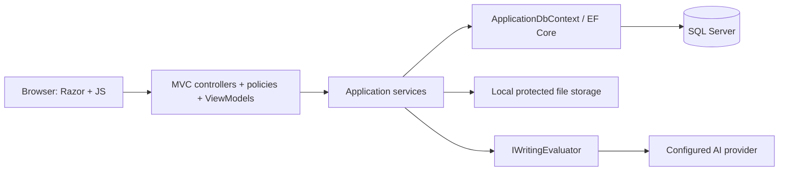
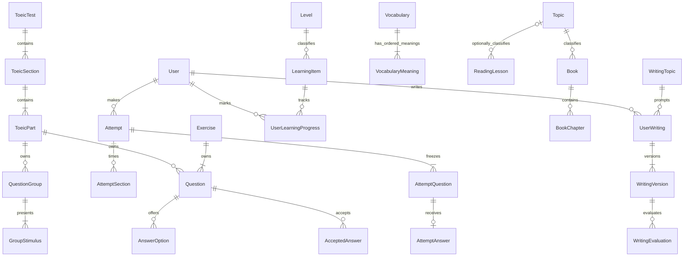

# EnglishHub — Architecture & Implementation Plan

Trạng thái: **Approved/Baselined Architecture Plan**. Ngày lập: 2026-09-13. Revision: **1.1**.

Requirements nghiệp vụ đã khóa qua bản phân tích 14 mục và các xác nhận sau phỏng vấn. Người dùng đã duyệt kiến trúc và cho phép tạo TASKS.md sau ba chỉnh sửa revision 1.1: VocabularyMeaning quan hệ 1-N có thứ tự; rule Practice TOEIC tách với Full; Reading không bắt buộc Topic. PLAN là baseline đã duyệt, không phải giấy phép implementation. TASKS.md phải được trình duyệt riêng; chưa viết code, tạo migration hoặc cài package.

## 1. Thẩm quyền yêu cầu và phạm vi

Thứ tự ưu tiên: quyết định mới nhất của người dùng > baseline phân tích và PLAN đã xác nhận > docs/REQUIREMENT.md > tài liệu thiết kế giao diện cũ. Kiến trúc trong PLAN đã được duyệt; chi tiết kỹ thuật để lại cho implementation phải trong ranh giới này, không tự thay đổi nghiệp vụ.

### 1.1 Baseline bắt buộc

- Student đăng ký rồi đăng nhập để học; Admin riêng, không tham gia học. Mỗi tài khoản một role. Chạy/demo một máy, một người phát triển; có thể mở rộng sau.
- Vocabulary, Grammar, Listening, Reading, Writing tự học; Lộ trình A1–C2 chọn tự do; Books theo chủ đề, không gán level. Ghi nhớ level đang chọn.
- Vocabulary mỗi mục một loại từ, nhiều nghĩa qua quan hệ Vocabulary 1-N VocabularyMeaning có thứ tự hiển thị, không dùng chuỗi phân cách; một chủ đề/một level; audio URL tùy chọn, không có thì ẩn nghe. Có tìm/lọc và đánh dấu học.
- Grammar có nhóm, level, nội dung định dạng; lý thuyết/luyện tập chuyển tự do. Listening có chủ đề/level, audio URL bắt buộc, SRT/VTT, highlight/tự cuộn theo câu, ẩn/hiện chữ, tua/nghe lại, không chỉnh tốc độ.
- Reading độc lập bắt buộc Level, Topic tùy chọn; Vocabulary/Listening/Writing vẫn bắt buộc Topic. Reading có bài tập, từ vựng bên dưới và bản dịch tùy chọn mặc định ẩn. Books nhập văn bản từng chương, bản dịch tùy chọn, chương mở tự do, không bài tập; nhớ chương gần nhất, không nhớ cuộn.
- Bài tập ở cả Vocabulary/Grammar/Listening/Reading: chọn một đáp án, True/False và tự gõ một chỗ trống/câu. Một nội dung có thể có nhiều bộ bài tập; Vocabulary gắn chủ đề và level. Không trộn module hoặc ngân hàng câu hỏi dùng chung.
- Tự học: đúng/tổng * 100, làm tròn hai chữ số thập phân, trọng số câu bằng nhau, không ngưỡng đạt; tách đúng/sai/trống. Làm lại không giới hạn, nộp thiếu được sau cảnh báo; không đảo thứ tự.
- Writing lưu thủ công, nhiều bài/Topic, văn bản thuần/đếm từ, tối đa 20.000 ký tự; không rỗng, không giới hạn số từ theo đề. Lưu và AI chấm riêng; giữ phiên bản và soft delete, Admin vẫn xem.
- AI Writing: bốn tiêu chí 0–10 trọng số 25%, Overall trung bình làm tròn một chữ số; feedback Việt, lỗi/cách sửa, không viết lại toàn bài. Phiên bản thành công không chấm lại; lỗi được thử lại; một yêu cầu chạy/bài, không quota ngày.
- TOEIC: Draft, chủ động Publish, Ẩn/Hiện. Publish được các Part hợp lệ trước; cả kỹ năng cần mọi Part tương ứng hợp lệ; Full chỉ khi đủ cấu trúc. Practice một Part hoặc toàn Listening hoặc toàn Reading; không tổ hợp Part tùy ý, không tính giờ, tua/nghe lại được.
- Full TOEIC: 7 Part/200 câu; Listening 100 câu khoảng 45 phút, Reading 100 câu/75 phút. Server quyết định mốc, Listening hết hạn khóa và chuyển Reading; audio kết thúc sớm không tự chuyển. Full không tua/nghe lại.
- **TOEIC trả số đúng/tổng số câu và tỷ lệ phần trăm chính xác; không quy đổi điểm TOEIC.** Đây là quyết định cuối thay thế mọi mô tả cũ chỉ có số đúng.
- Full được autosave server để giữ dữ liệu trước hạn, nhưng **không resume sau reload/đóng tab**. Mất mạng tạm thời giữ thay đổi trên trang; sau hạn không nhận đáp án mới, finalize từ dữ liệu server đã nhận hợp lệ trước hạn. Không có dữ liệu được ghi nhận thì báo không thể ghi nhận lượt thi.
- Thoát TOEIC: Tiếp tục / Nộp và thoát / Bỏ bài. Bỏ không tạo kết quả/lịch sử Admin; lỗi audio nghiêm trọng được hủy. Tab treo/đóng đột ngột không yêu cầu xử lý hoàn hảo.
- Nội dung tự học lưu hợp lệ hiển thị ngay, có Ẩn/Hiện; soft delete giữ lịch sử. Sửa/ẩn/xóa không đổi đề của lượt đang làm hoặc kết quả cũ.
- Tiến độ tự học đánh dấu độc lập bài tập; sách hoàn thành theo mọi chương hiện hữu đang hiển thị. Writing Topic hoàn thành khi còn bài không rỗng/chưa xóa. Thống kê tách tự học/AI/TOEIC; dùng kết quả gần nhất mỗi bài, Writing dùng phiên bản chấm thành công gần nhất dù bản mới chưa chấm.
- Hồ sơ: tên/email/avatar/ngày tạo; sửa tên/avatar/mật khẩu, không đổi email. Mật khẩu 6 ký tự tối thiểu, không bắt buộc thành phần, không khóa tạm do sai. Admin khóa có hiệu lực từ request tiếp theo.
- Việt/Anh cho giao diện, mặc định Việt, không bắt buộc dịch nội dung học. Sidebar tối có icon và tên; mobile thu gọn. Landing page giữ nguyên giao diện/nội dung theo ngoại lệ đã xác nhận.

### 1.2 Ngoài phạm vi

Course/Enrollment, IELTS, Speaking/thu âm, chatbot/AI gia sư, viết lại toàn bài, SRS/flashcard/favorite, gamification, Teacher/lớp học, payment, mobile app riêng/PWA/offline, PDF/EPUB reader, crawler Study4/nhập hàng loạt đề, ngân hàng câu hỏi, random đề, email verification/CAPTCHA/quên mật khẩu email, resume thi, bài làm trễ hạn, audit phức tạp. Không triển khai chức năng chỉ vì landing đang quảng bá.

## 2. Hiện trạng và cách giữ project

- EnglishHub.csproj target net10.0; Program.cs chỉ đăng ký MVC, routing/static assets/authorization middleware; chưa cấu hình authentication, EF/SQL Server.
- Có HomeController, ErrorViewModel, Razor landing/layout, CSS brottin-theme.css, site.js và tài nguyên hình; chưa có domain models, DbContext hoặc migration.
- docs/DESIGN.md mang ngữ cảnh Brottin khác sản phẩm; không dùng để override baseline. docs/HOMEPAGE-IMPLEMENTATION.md mô tả landing; không coi số liệu marketing là seed đã có.
- Không tạo lại project. Giữ Home/Index và hình ảnh, CSS hiện có. Tách layout Student/Admin thay vì đổi toàn bộ layout landing. Khi implementation chỉ nối nút đăng nhập sang luồng thật, giữ nhãn/phong cách/nội dung quảng bá; không tự dịch lại landing theo yêu cầu giữ nguyên.
- Không build/test code trong giai đoạn PLAN; kiểm tra ở đây chỉ là đọc và đối chiếu tài liệu.

## 3. Kiến trúc tổng thể

Chọn **modular monolith**, một ASP.NET Core MVC host và một SQL Server database. Razor server-rendered; JavaScript theo trang cho audio/subtitle, timer/autosave và trạng thái AI. Không React/Vue/Angular, microservices, CQRS/MediatR, generic repository hoặc message broker.

Controller chỉ xử lý HTTP, validation, gọi service, trả ViewModel/JSON; không chứa cấu trúc TOEIC/chấm điểm/transactions. EF DbContext scoped dùng trực tiếp trong service; interface tập trung ở các điểm thay thế như AI, file storage và clock. Các rule chấm/publish/timing là thành phần nhỏ dễ unit test.

### 3.1 Thư mục dự kiến (chưa tạo)

| Đường dẫn | Vai trò |
|---|---|
| Controllers/ | Home, Account, Culture và endpoint dùng chung |
| Areas/Student/Controllers, Views | Dashboard, Roadmap, từng module, Exercises, Toeic, Results, Profile |
| Areas/Admin/Controllers, Views | Users, Topics/Groups, nội dung, Books/Chapters, Exercises, Toeic, Results |
| Domain/Entities, Enums | Entities và trạng thái nghiệp vụ |
| Data/Configurations, Migrations, Seed | DbContext, Fluent mapping, migration và seed khi được phép |
| Services/Accounts, Learning, Exercises, Toeic, Writing, Progress | Use cases, transactions và rule |
| Infrastructure/AI, Media, Security | Adapter bên ngoài, file parser/storage, cookie validation |
| ViewModels/Student, Admin, Account | Input/output riêng, không bind entity nhạy cảm |
| Options/, Resources/ | Cấu hình có validation; .resx Việt/Anh |
| wwwroot/js, css | JS/CSS module, layout học/Admin tách landing |
| tests/EnglishHub.Tests, EnglishHub.IntegrationTests | Dự kiến test rule và integration khi implementation |

Razor partials cho sidebar, pagination, bộ câu hỏi, trạng thái validation; Bootstrap 5 dùng cho khu vực mới nếu phù hợp, không nạp CSS toàn cục làm thay đổi landing. Không bắt buộc package UI nặng.

### 3.2 Services và ranh giới

| Service | Trách nhiệm |
|---|---|
| AccountService / ActiveAccountValidator | Identity, profile, role, kiểm tra IsActive mỗi request |
| ContentService theo module | CRUD, hidden/deleted, scope level/topic, search/pagination |
| SubtitleService | Parse/validate SRT/VTT, cue order, serialize dữ liệu an toàn |
| ExerciseService / ScoringPolicy | Câu hỏi, snapshot đầu lượt, submit và chấm tự học |
| ToeicPublicationService | Validate Part/kỹ năng/Full và Publish |
| ToeicAttemptService | Start, autosave, transitions, submit/finalize/abandon |
| WritingService / EvaluationService | Lưu version, concurrency AI, kết quả và soft delete |
| ProgressQueryService | Tính tiến độ và thống kê từ dữ liệu gốc |
| IWritingEvaluator / IFileStorage | Adapter có thể thay provider/storage mà không đổi controller |

## 4. Data model dự kiến

SQL Server Express instance local với Windows Authentication là lựa chọn mặc định demo; LocalDB là phương án tương đương nếu máy đã có. Kiểm tra môi trường trước khi implementation, không cài đặt ở giai đoạn này. Một ApplicationDbContext mở rộng IdentityDbContext. EF Core 10.x/provider SQL Server và tooling cùng major, chọn patch tương thích lúc triển khai.

Quy ước: PK int cho nội dung, GUID cho User/Attempt/Writing/Evaluation; UTC DateTimeOffset cho thời gian; decimal cho điểm; rowversion cho dữ liệu cạnh tranh. Nội dung có CreatedAt, UpdatedAt, IsVisible, IsDeleted, DeletedAt. Kiểu câu hỏi và lifecycle dùng enum persisted, không dựa vào nhãn UI.

### 4.1 Tài khoản và nội dung

| Entity | Fields chính / constraints |
|---|---|
| ApplicationUser | Identity fields, FullName, AvatarFileId?, IsActive, CreatedAt, SelectedLevelId? |
| IdentityRole / UserRole | Admin/Student; unique UserId trên bảng liên kết để tối đa một role |
| Level | Id, Code unique A1–C2, SortOrder; seed cố định, không CRUD |
| Topic | Id, Name, Description; một chủ đề có nội dung nhiều level |
| GrammarGroup | Id, Name, Description |
| LearningItem | Id, Kind, Title, Description, LevelId, TopicId?, GrammarGroupId?, visibility/delete/timestamps |
| Vocabulary | LearningItemId PK/FK, Word, Pronunciation, PartOfSpeech, Example, AudioUrl?, ImageUrl?; không có MeaningVi đơn |
| VocabularyMeaning | Id PK, VocabularyId FK tới Vocabulary.LearningItemId, MeaningVi, DisplayOrder; unique (VocabularyId, DisplayOrder), DisplayOrder > 0 |
| GrammarLesson | LearningItemId PK/FK, Formula, Usage, Examples, Notes?; rich text được sanitize |
| ListeningLesson | LearningItemId PK/FK, AudioUrl, SubtitleFileId?, transcript/cue revision |
| TranscriptCue | Id, ListeningLessonId FK, Sequence, StartMs, EndMs, Text; unique lesson/sequence |
| ReadingLesson | LearningItemId PK/FK, ContentEn, TranslationVi?, VocabularyNotes?; LevelId bắt buộc, TopicId nullable ở LearningItem |
| WritingTopic | LearningItemId PK/FK, Prompt, SuggestedVocabulary?; không min/max word rule |
| Book | Id, TopicId FK, Title, Author, Description, CoverUrl?, visibility/delete; **không LevelId** |
| BookChapter | Id, BookId FK, Order, Title, ContentEn, TranslationVi?, VocabularyNotes?, visibility/delete |
| StoredFile | Id, StorageKey, Kind, ContentType, SizeBytes, OriginalName, CreatedAt; không dùng tên người dùng làm path |

LearningItem là record đầu mục chung có FK thật cho tiến độ; các bảng chi tiết dùng quan hệ 1–1 qua shared PK, không ORM inheritance phức tạp. Service transaction đảm bảo đúng một subtype tương ứng Kind. LevelId bắt buộc cho mọi LearningItem. Check constraints bắt buộc TopicId cho Vocabulary/Listening/Writing, cho phép TopicId null ở Reading và áp dụng GrammarGroup cho Grammar. Reading không Topic vẫn được lưu/hiển thị, học và làm bài tập; query không dùng inner join Topic làm mất các bài này. Nếu Reading có TopicId thì FK phải hợp lệ. Không thêm Skill/Course/LearningContent hierarchy thứ hai.

Vocabulary có từ một đến nhiều VocabularyMeaning; mỗi record chứa một nghĩa không rỗng, sắp theo DisplayOrder. Admin thêm/sửa/bỏ/sắp xếp nghĩa trong form Vocabulary và lưu parent/children một transaction; không cho bỏ nghĩa cuối cùng. Không lưu nhiều nghĩa bằng chuỗi phân cách hoặc JSON thay quan hệ. Tìm theo nghĩa dùng EXISTS/Any trên VocabularyMeaning để không lặp mục từ khi nhiều nghĩa khớp; danh sách/chi tiết hiển thị theo thứ tự. Khác loại từ vẫn là Vocabulary riêng. Soft delete Vocabulary giữ meaning con; câu hỏi/đáp án Admin soạn và snapshot không phụ thuộc live meaning. VocabularyNotes của Reading/Books vẫn là văn bản trình bày, không phải mô hình nhiều nghĩa của Vocabulary. Chapter không gán level và không có exercise. Book/Chapter có thứ tự duy nhất trong sách.

### 4.2 Bài tập và đề TOEIC

| Entity | Fields chính / constraints |
|---|---|
| Exercise | Id, Title, OwnerKind, LearningItemId?, VocabularyTopicId?, LevelId?, visibility/delete |
| ToeicFormatProfile | Id, Code, Version, ListeningSeconds, ReadingSeconds, rules/config; bản cấu hình đã dùng là bất biến |
| ToeicTest | Id, Title, Description, FormatProfileId FK, PublicationStatus, PublishedAt?, IsVisible, IsDeleted, RowVersion |
| ToeicSection | Id, TestId FK, Kind Listening/Reading, FullAudioUrl?; unique test/kind |
| ToeicPart | Id, SectionId FK, Number, Instructions, Order; unique section/number, số 1–7 |
| QuestionGroup | Id, PartId FK, Order, StimulusKind; không dùng chung nhiều Part/đề |
| GroupStimulus | Id, GroupId FK, Order, Kind Text/Image/Audio, ContentOrUrl; cho nhiều đoạn/ảnh trong một group |
| Question | Id, ExerciseId? hoặc ToeicPartId?, QuestionGroupId?, Type, Order, Prompt, Explanation?, Transcript?, Translation? |
| AnswerOption | Id, QuestionId FK, Order, Text, IsCorrect |
| AcceptedAnswer | Id, QuestionId FK, Text, NormalizedText; cho một blank, nhiều đáp án được chấp nhận |

Exercise có đúng một owner: chủ đề Vocabulary + level, hoặc LearningItem thuộc Grammar/Listening/Reading; không owner Writing/Book. Question có đúng một ExerciseId/ToeicPartId (XOR check). Nếu có group phải cùng Part; dùng FK ghép group/Part để ngăn liên kết chéo. TOEIC dùng Multiple Choice; fill text tự gõ là dạng bài tự học, không biến TOEIC Part 5/6 thành free-text.

Rules con của ToeicFormatProfile (PartRule, GroupRule) có thể là bảng con nhỏ hoặc JSON schema được validate; đề xuất JSON versioned vì profile chuẩn không cần UI chỉnh rule tổng quát trong MVP. Mọi validator đọc profile, không đọc hằng số trong controller. Nội dung đề và thời lượng chọn profile qua form Admin; cập nhật format tạo version mới, không sửa profile đã gắn lượt làm.

### 4.3 Lần làm và bản đề lịch sử

| Entity | Fields chính / constraints |
|---|---|
| Attempt | Id, UserId FK, ExerciseId? / ToeicTestId?, Mode, Scope, SelectedPart?, Status, StartedAtUtc, SubmittedAtUtc?, Counts, Percent?, ActiveKey?, RowVersion |
| AttemptSection | Id, AttemptId FK, Kind, StartsAtUtc, EndsAtUtc, LockedAtUtc?; fixed Full timing |
| AttemptQuestion | Id, AttemptId FK, SourceQuestionId (tham chiếu tùy chọn), Section/Part, Order, SnapshotJson |
| AttemptAnswer | AttemptQuestionId FK, SelectedOptionSnapshotKey? / Text?, Sequence, ReceivedAtUtc, RowVersion |
| AttemptSnapshot | AttemptId PK/FK, SchemaVersion, Header/Group/StimulusJson, FormatSnapshotJson |

Start chụp snapshot bất biến câu hỏi, lựa chọn, đáp án, explanation, stimulus, tiêu đề và timing profile trong một transaction nhất quán. Mọi chấm/view kết quả dựa snapshot, không join nội dung đang bị Admin sửa. Snapshot JSON là dữ liệu nhỏ có version schema; FK câu trả lời trỏ AttemptQuestion, không trỏ lựa chọn sống đã sửa/xóa.

Snapshot server giữ answer keys; ViewModel đang thi loại hoàn toàn keys/explanations/transcripts/bản dịch. Không gửi JSON snapshot đầy đủ vào hidden field hoặc JS rồi chỉ ẩn bằng CSS.

Attempt có đúng một source bài tập/TOEIC. Unique filtered index UserId + ActiveKey khi ActiveKey không null: một active attempt cho cùng nguồn, kể cả chọn scope TOEIC khác. Finalize có unique result theo AttemptId và transaction idempotent, không bảng Result trùng dữ liệu không cần thiết.

### 4.4 Writing và tiến độ

| Entity | Fields chính / constraints |
|---|---|
| UserWriting | Id, UserId FK, WritingTopicId FK, CurrentVersionId?, LastSuccessfulEvaluationId?, IsDeleted, timestamps, RowVersion |
| WritingVersion | Id, UserWritingId FK, VersionNumber, Text, TextHash, CreatedAt; unique writing/version |
| WritingEvaluation | Id, VersionId FK, RunNumber, Status, four criterion scores, OverallScore, FeedbackJson, Provider, Model, PromptVersion, PromptSnapshot, StartedAt, CompletedAt?, ErrorCode?, lease |
| UserLearningProgress | UserId + LearningItemId composite PK, IsLearned, LearnedAt?, UpdatedAt |
| UserChapterProgress | UserId + ChapterId composite PK, IsRead, ReadAt?, UpdatedAt |
| BookReadingPosition | UserId + BookId composite PK, LastChapterId, LastOpenedAt |

WritingVersion bất biến; Save không đổi nội dung thì không tạo version mới. Edit tạo version mới; soft delete UserWriting giữ con. Filtered unique thành công/version; khóa đang chạy theo UserWriting để ngăn hai version chấm đồng thời. Error retry tạo run mới, không overwrite thành công. Lưu metadata provider thực trả về; score server tính, không tin overall AI tự ghi.

Progress là derived query, không lưu trùng tỷ lệ hoàn thành. Topic Writing hoàn thành bằng EXISTS bài không rỗng/chưa xóa; xóa bài cuối tự làm mất trạng thái hoàn thành. Điểm Writing lấy LastSuccessfulEvaluation cho từng UserWriting còn hoạt động rồi tính trung bình; bản mới chưa chấm có badge. Nội dung hidden/deleted không nằm denominator/summary hiện tại, lịch sử riêng vẫn truy cập được. Không có nội dung thì hiển thị empty state, không chia 0 hoặc báo đã hoàn thành 100%.

### 4.5 Quan hệ chính

Hai đường owner Question trong sơ đồ là XOR, không phải một câu thuộc cả hai. Quan hệ Topic tùy chọn của Reading đi qua LearningItem.TopicId, không tạo cột TopicId trùng ở ReadingLesson.

### 4.6 Delete, indexes và consistency

- Không cascade delete từ User/nội dung/đề tới lịch sử. FK Restrict/NoAction; chỉ cascade các con thuần cấu hình chưa sử dụng nếu có purge kỹ thuật được duyệt riêng. MVP không có hard delete tài khoản.
- Query filter soft delete; truy vấn lịch sử/Admin dùng đường rõ ràng bỏ filter phù hợp, luôn kiểm tra owner. Không bỏ filter chung rồi lộ dữ liệu người khác.
- Unique NormalizedEmail (không chỉ UserManager check), Role membership UserId, level code, chapter/order, option/order, group/order, sequence cue. Đáp án blank normalized không trùng trong câu.
- VocabularyMeaning: unique (VocabularyId, DisplayOrder), FK bắt buộc, MeaningVi không rỗng, DisplayOrder dương; service transaction giữ ít nhất một nghĩa. Reading.TopicId nullable qua LearningItem; không tạo check Required chung cho Topic của mọi subtype.
- Index content theo visibility/delete/level/topic; Attempt(UserId, Status, SubmittedAt); Writing(UserId, TopicId, IsDeleted); Evaluation(VersionId, Status); progress composite PK.
- Check range scores 0–10, percent 0–100, Start < End, sequence không âm, XOR owner và scope; đáp án đúng đúng một được service transaction kiểm tra vì cross-row invariant.
- Rowversion xử lý stale Admin edit, autosave và submit race. Index active + transaction bảo vệ đồng thời; không dựa vào UI disable.

## 5. Authentication, authorization và validation

Identity UserManager/SignInManager + cookie auth; MVC Account views tùy chỉnh, không scaffold toàn bộ UI Identity. Register tạo Student trong transaction, sign-in không tự động. Login chuyển role đúng area. Mật khẩu cấu hình min 6, bỏ yêu cầu chữ/số/non-alphanumeric/hoa; RequireConfirmedAccount/Email=false, login lockoutOnFailure=false. Đây là nghiệp vụ đã khóa, không tự thêm khóa tạm hoặc độ phức tạp.

Policies StudentOnly, AdminOnly và ActiveAccount; IsActive kiểm tra DB trên mỗi authenticated request/cookie validation để Admin khóa tác động request tiếp theo, không chỉ chờ security-stamp interval. Login cũng kiểm tra IsActive. Student ownership dùng user ID từ principal; không tin posted UserId/Role/Score. Admin không truy cập student attempt actions dù xem được kết quả qua Admin views.

Đăng xuất POST có antiforgery; form/AJAX mutation đều CSRF token. HTTPS, HttpOnly cookie, SameSite phù hợp; không JWT/session tự chế. Bảo vệ cả media/subtitle endpoints. Password change yêu cầu mật khẩu hiện tại; đổi email/role không có form public. Secret Manager hoặc environment cho SQL/API/demo credentials; không đưa mật khẩu seed vào source.

Validation server + client, giới hạn request/file, encode output. Rich text chỉ whitelist đậm/nghiêng/danh sách/bảng/link an toàn; sanitize khi lưu, không cho script/iframe/event handlers. Feedback AI là dữ liệu không tin cậy, encode như user input. Không gửi đáp án hoặc nhận score từ browser; mẫu JSON lỗi có mã ổn định để localization. Error 403/404/500 có UI, không lộ stack trace; log không chứa mật khẩu/API key/toàn bài Writing.

## 6. Localization và UI

Dùng ASP.NET Core RequestLocalization với whitelist vi/en, .resx qua IStringLocalizer/IViewLocalizer/DataAnnotations. Default vi kể cả Accept-Language của browser là en. Đề xuất culture qua query/route value được truyền trong link/form của khu vực mới, không lưu profile/cookie dài hạn để không tự thêm yêu cầu ghi nhớ. Chọn en duy trì khi điều hướng nội bộ; URL không chỉ định culture về vi. Culture không đổi parser UTC/JSON, normalization answer hoặc decimal lưu DB.

Dịch menu/nút/errors/validation/empty state của Student/Admin/Account; dữ liệu học không dịch tự động, tên loại từ/chủ đề do Admin nhập giữ nguyên; AI feedback luôn Việt. Landing giữ nguyên là ngoại lệ rõ ràng của baseline, không hứa mọi chữ landing đổi ngôn ngữ. Không để UI lộ provider/prompt/schema; chỉ trạng thái chấm, thất bại và retry có ý nghĩa.

Student layout: Trang chủ, Bảng điều khiển, Lộ trình, Luyện thi, Ngữ pháp, Luyện từ, Nghe, Đọc, Viết. Books nằm trong Đọc. Profile/Logout ở menu tài khoản. Dùng nền tối nhưng panel nội dung đọc rõ, focus-visible, icon có tên/aria, responsive/empty/success/error states. Không dùng cỡ chữ hoặc màu nền gây khó đọc để cố giữ hiệu ứng kính.

## 7. File/media handling

- File local ngoài wwwroot, mặc định thư mục App_Data/uploads được cấu hình bằng đường dẫn tuyệt đối ngoài source triển khai; không commit file người dùng. IFileStorage cho phép thay storage sau.
- Avatar upload JPG/PNG/WebP <=2 MB: kiểm tra byte signature/khả năng decode, size/dimensions hợp lý, tạo storage key ngẫu nhiên; không chấp nhận SVG/executable. Trả đúng Content-Type qua endpoint kiểm tra quyền.
- Subtitle SRT/VTT <=1 MB: UTF-8, parse mốc, start < end, sort/order và cue text, reject lỗi có vị trí. Lưu source file và parsed cues theo transaction/compensation để không orphan. Render text không HTML. Dữ liệu đồng bộ cần Admin chuẩn bị; không tự tạo timestamp bằng AI.
- Ảnh nội dung/audio là URL HTTP(S), ưu tiên HTTPS để không mixed content. Không server-fetch URL tùy ý nhằm tránh SSRF; browser phát nguồn có quyền dùng, cần Range/CORS phù hợp nếu nguồn yêu cầu. URL lỗi có fallback/thông báo; không tự crawl/cache Study4.
- Vocabulary thiếu audio ẩn nút; Listening cần audio; full section audio URL phải phù hợp timing. Practice có audio ở stimulus/group/Part; Admin cung cấp section track cho Full, không tự ghép audio vào MVP.
- Snapshot giữ URL nhưng không thể giữ nội dung file bên thứ ba nếu họ đổi/xóa. Bảo toàn tuyệt đối áp dụng câu hỏi/đáp án/nội dung text; media ngoại vi là dependency được nêu rõ. Demo ưu tiên URL ổn định và nguồn được phép.
- Backup manual trước demo/migration: SQL backup, thư mục uploads và cấu hình cần phục hồi an toàn; không backup secrets vào repo. Restore vào DB/thư mục thử để kiểm tra liên kết file. Chưa xây hệ thống backup UI/scheduler.

## 8. AI abstraction và lifecycle

IWritingEvaluator nhận prompt đề + immutable WritingVersion; trả DTO gồm bốn score, feedback Việt và metadata. Adapter dùng IHttpClientFactory/typed client, cấu hình Provider/Model/timeout/API key qua options/secrets. Không khóa vendor trong domain; chỉ cài một adapter thực khi implementation và chọn provider có hỗ trợ phản hồi cấu trúc phù hợp. Không thêm SDK nếu HTTP adapter đủ.

Luồng: validate user/bài còn hoạt động -> lấy version -> nếu Succeeded trả kết quả -> chiếm lease một job/bài trong DB -> ghi Pending/Running -> gọi provider ngoài transaction DB -> validate score/type/range/language/length -> server tính decimal mean và Round(1, AwayFromZero) -> ghi Succeeded atomically, cập nhật latest-success pointer đúng version. Nếu bản mới đã lưu lúc chấm, không overwrite CurrentVersion; chỉ gắn kết quả vào bản đã gửi.

Timeout khởi điểm 60 giây cấu hình được (đề xuất kỹ thuật); hết lease chuyển Failed có retry. HTTP call không giữ transaction lâu. Không auto retry mù gọi mất phí; explicit retry lỗi, dùng idempotency provider nếu hỗ trợ. Unique successful/version và khóa writing chống double-click/nhiều tab. Khi provider đã nhận nhưng response mất có thể phát sinh lần tính phí khác ở retry; không cam kết exactly-once với dịch vụ ngoài.

Prompt tách hướng dẫn hệ thống khỏi bài Student, coi bài là dữ liệu không phải lệnh; không cho AI truy cập tool/database. Validate output không đủ hoặc ngoài 0–10 thành Failed, không clamp thành điểm giả. Lưu PromptVersion/đề tại lúc chấm, provider/model thực tế, thời điểm, lỗi có mã. Không log raw bài/key. Adapter fake chỉ trong test, không seed điểm giả mang nhãn AI thật.

## 9. TOEIC publication, timing và autosave

### 9.1 Format và Publish

Profile khởi tạo cho TOEIC Listening/Reading: Part 1=6, 2=25, 3=39, 4=30, 5=30, 6=16, 7=54; Listening 100/45 phút, Reading 100/75 phút. Part 2 có 3 options, các Part khác 4; đều single-choice. Group rule Full: Part 3 có 13 group x3, Part 4 có 10 x3, Part 6 có 4 x4; Part 7 single passages 29 câu (10 nhóm 2–4 câu) và multiple passages 25 câu (5 nhóm x5). Đối chiếu ETS trong mục nguồn; không quy đổi điểm chuẩn ETS.

**Rule Practice/MVP, không phải số lượng chuẩn Full TOEIC:** một Part có ít nhất 1 câu hỏi hợp lệ cùng đầy đủ option, đúng một correct answer, stimulus bắt buộc và tham chiếu trong cùng Part thì có thể Practice. Các câu đưa vào lượt Practice đều phải hợp lệ; câu thiếu dữ liệu không được lọt vào lượt. Không áp số lượng câu/nhóm chuẩn Full cho Practice. Ví dụ Part 1 có 1 câu đủ dữ liệu được Practice nhưng chưa đạt 6 câu của Full. Toàn Listening Practice yêu cầu Part 1–4 đều đạt rule Practice; toàn Reading Practice yêu cầu Part 5–7 đều đạt rule Practice. Full validator thêm count/group/profile/section audio/duration và tổng 200; không đặt nhãn Full chỉ vì có 200 câu trộn sai Part. Publish yêu cầu >=1 Part valid; phản hồi lỗi theo Part/group/question, bảng capability của đề: các Part, ListeningPractice, ReadingPractice, Full.

Admin edit đề đã Publish: đề xuất chuyển về Draft trong transaction, giữ snapshot của lượt đang làm và lịch sử; Admin Publish lại có chủ đích. Hide không xóa status Published; khi show tính lại eligibility. Không cho mở một đề hidden/deleted/Draft, nhưng lượt đã bắt đầu vẫn dùng snapshot. Không xây revision editor đôi phức tạp trong MVP.

### 9.2 Start và thời hạn

Full start sau kiểm tra media sẵn sàng và thao tác chủ động của Student (browser autoplay có thể cần gesture). Transaction tạo Attempt, snapshot, ActiveKey và mốc T0 server; ListeningEnd=T0+profile.ListeningSeconds; ReadingEnd=ListeningEnd+profile.ReadingSeconds. Không kéo dài theo thời điểm browser kết nối lại. IClock/TimeProvider dùng UTC server để test được; đồng bộ clock máy demo.

Browser nhận ServerNow/section deadlines để vẽ countdown, nhưng mọi endpoint tính lại từ clock server. Trước ListeningEnd chỉ nhận Listening; từ ListeningEnd chỉ nhận Reading; tại/qua ReadingEnd từ chối mọi thay đổi. Section audio hết sớm không đổi phase. Browser kiểm tra phase định kỳ/khi focus/reconnect; timer có thể trễ nhưng server vẫn đúng.

Full UI chỉ cung cấp player không tua/nghe lại, không transcript/đáp án. Không cam kết DRM/chống người dùng sửa devtools để phát URL ngoài player. Mục tiêu MVP là hành vi UI và bảo vệ đáp án/thời gian trên server.

### 9.3 Autosave và submit

- Full gửi batch thay đổi sau debounce khoảng 1 giây và nhịp kiểm tra khoảng 5 giây (options kỹ thuật), kèm thứ tự tăng dần theo answer; server trả ACK/time/phase. UI phân biệt Đang lưu/Đã lưu/Mất kết nối.
- Mỗi mutation kiểm tra owner/IsActive/active attempt, token phiên thi, phase, deadline và sequence. Ghi thời điểm nhận từ server tại xử lý transaction; không dùng timestamp client để cho phép nộp muộn. Update có điều kiện deadline/status ở DB; nếu chờ lock tới quá hạn thì reject, không đóng dấu thời gian lùi.
- Batch mixed section xử lý từng answer hợp lệ, không nhận Reading trước giờ hoặc Listening sau khóa. Sequence cũ không được overwrite mới; retries idempotent. ACK chỉ sau commit.
- Offline giữ thay đổi trong RAM trang, không localStorage/IndexedDB resume. Reconnect trước hạn gửi lại dữ liệu còn trong phase; hết hạn chỉ gọi finalize, không gửi thay đổi pending cũ để ghi điểm.
- Nộp sớm trước hạn có thể commit batch hợp lệ cuối cùng + finalize một transaction. Hết hạn finalize chỉ đọc snapshot đáp án đã persist trước deadline của từng section. Click submit/autosave/timeout race được serialize; một result duy nhất.
- Có ít nhất một answer được ghi nhận hợp lệ thì finalize theo bản cuối server (trống/sai vẫn 0); không có answer record nào thì trạng thái không ghi nhận, không result. Tránh heartbeat giả tạo answer record.
- Percent = CorrectCount / TotalQuestionsInAttempt * 100 dùng decimal, hiện hai số thập phân (ghi tròn khi cần), không integer truncation hoặc scale 990. Luôn hiện numerator/denominator; dữ liệu gốc giữ count để không mất độ chính xác. Full denominator 200; Practice denominator theo scope snapshot. Breakdown Part/section áp dụng cùng công thức.
- Practice và bài tập tự học không autosave đáp án server; nộp mới lưu/chấm, giữ snapshot đầu lượt. Practice không deadline; full và practice không lẫn eligibility/scoring mode.

### 9.4 Không resume và xử lý bỏ/đóng trang

Start cấp random attempt token chỉ giữ trong RAM trang, server lưu hash; không endpoint trả lại token hoặc answers để resume. Active attempt query chỉ phục vụ kiểm tra slot, không cấp tiếp quyền cho trang reload. Tab gốc có token vẫn được tiếp tục; mở thêm tab nhận thông báo đang có lượt làm, không tạo duplicate.

Nút Bỏ bài/Audio lỗi gửi abandon có CSRF; xóa dữ liệu tạm/snapshot và giải phóng ActiveKey, không result/history Admin. pagehide/beforeunload gửi abandon best-effort, browser dialog chỉ là cảnh báo chuẩn, không phải ba nút tùy biến. Hộp ba nút chỉ cho nút Thoát trong app.

Server không thể phân biệt chắc chắn đóng tab với mất mạng. Vì vậy **không có worker tự chấm mọi attempt hết giờ khi không có browser**, sẽ trái quy tắc bỏ bài. Trang còn sống gọi finalize khi hết giờ/reconnect bằng token RAM; server dùng dữ liệu đã lưu trước hạn. Dọn attempts mồ côi bằng thời hạn kỹ thuật cấu hình (đề xuất 24 giờ sau Full deadline / last activity Practice), không biến thành result. Khoảng giữ này không kéo dài thời gian nhận đáp án và không hỗ trợ resume. Cho chủ tài khoản chủ động bỏ attempt cũ để giải phóng slot nếu unload không tới server.

Nếu browser treo/đóng đột ngột hoặc server restart khiến pending không thể hoàn tất, hiển thị không ghi nhận và dọn lượt; không hứa xử lý hoàn hảo. Cần test reconnect khi mất mạng đúng deadline và không đánh đồng thiếu heartbeat vài giây là bỏ bài.

## 10. Migration và seed strategy (chỉ kế hoạch)

Hiện chưa có migration/schema cần nâng cấp. Trước migration đầu tiên phải có entity/field/PK-FK/check/index/delete behavior cụ thể, đối chiếu PLAN và test rule. **Không tạo migration trong lượt lập PLAN.**

Các đợt dự kiến khi đã được phép implementation:

1. Identity, Level/Topic/GrammarGroup, StoredFile.
2. LearningItem/subtypes, VocabularyMeaning 1-N có thứ tự, Reading.TopicId nullable qua LearningItem, subtitle, Books/Chapters, progress.
3. Exercise/questions/options/accepted answers, attempt/snapshot/history.
4. Writing versions/evaluations và constraints concurrency.
5. TOEIC format/test/section/part/group và mở rộng attempt timing/answer persistence.

Mỗi migration kiểm tra SQL sinh ra, cascade path SQL Server, indexes filtered, default/backfill và khả năng apply trên DB sạch + DB từ phase trước. Không drop/recreate DB để chữa schema nếu có dữ liệu. Dùng script idempotent hoặc migration command rõ ràng trên DB demo sau backup; không auto Migrate mỗi production startup. Downgrade có thể mất dữ liệu: ưu tiên sửa tiến thay vì hứa Down an toàn; backup là đường phục hồi.

Seed có cờ DemoEnabled riêng, idempotent dùng stable key, không overwrite nội dung Admin đã sửa; seed transaction theo module. Admin credential từ secret, không fixed password trong git. Seed hai Student: một có hoạt động qua service tạo dữ liệu hợp lệ, một trống. Không tạo fake AI success; chưa có key thì seeded writing ở trạng thái chưa chấm.

Dữ liệu A1/A2 đủ chứng minh các luồng, B1–C2 mẫu hoặc empty; 2–3 sách vài chương; Part 1–7 có câu/stimulus. Full 200 câu biên soạn hợp lệ là bổ sung nếu có nguồn, không điều kiện bắt buộc của seed demo. Tuy nhiên logic Full vẫn phải kiểm chứng bằng fixture tổng hợp đủ 200 câu trong test, không dùng fixture đó như đề thi thực có chất lượng. Không crawl/copy Study4; ghi attribution/source khi có nội dung được phép.

## 11. Thứ tự triển khai và cổng kiểm tra

Đây là phase ở mức PLAN, không TASKS. Mỗi phase giữ build được, UI + backend + validation + localization đi cùng chức năng. Không để toàn bộ security đến cuối.

| Phase | Kết quả cần đạt | Phụ thuộc / kiểm tra chính |
|---|---|---|
| 0. Chốt thiết kế chi tiết | Field matrix, schema constraints, package versions/provider/media options | Sau duyệt PLAN/TASKS và lệnh implementation; không đổi nghiệp vụ |
| 1. Nền tảng/Account | EF/Identity/roles, login/register/profile, layout Student/Admin, culture/error | Login, ownership, khóa account request tiếp theo, unique email |
| 2. Content nền | Topics/Groups/Levels, Vocabulary + ordered VocabularyMeaning/Grammar CRUD/read, rich text, hidden/delete, marks | Nghĩa relational/thứ tự/tìm kiếm, quyền Admin, filter level/topic, không sửa landing |
| 3. Listening/Reading/Books | Audio, parser/cues, translations, Reading Topic tùy chọn, chapter/reading position | Reading không Topic vẫn học được, Subtitle invalid, audio fail, sách không level, không bài tập sách |
| 4. Exercise/Result | Ba dạng câu hỏi, snapshots, attempts, submit/history | Score/normalization, blank, double submit, sửa đề không đổi lịch sử |
| 5. Writing/AI | Manual save/versions, evaluator adapter, feedback, soft delete | Version concurrency, timeout, reuse success, đúng điểm trung bình |
| 6. TOEIC authoring | Profile, Part/group/stimulus, Draft/Publish/capabilities | Part partial practice; Full đủ counts/groups/audio; validation server |
| 7. TOEIC attempts | Part/skill Practice, Full timer/autosave, abandon/finalize | Deadline server, race, offline, no resume, denominator chính xác |
| 8. Dashboard/Progress | Tổng hợp các module, latest score, activity, level nhớ, books riêng | Hidden/delete denominator, Writing last successful, xóa bài cuối |
| 9. Demo/Hoàn thiện | Seed, responsive/VI-EN, backup/restore, run guide | Build/tests/manual demo, empty/media/AI unavailable states |

Các fixture nhỏ đi cùng phase, không đợi phase cuối mới có dữ liệu thử. Provider AI chọn và kiểm tra capability trước phase 5; ưu tiên một adapter thực, không cần framework agent. Feature thiếu key không ngăn phần khác chạy.

## 12. Validation và tiêu chí nghiệm thu

- Unit tests tập trung rule có rủi ro: blank normalization/score, eligibility Full/Practice, section clock, writing average, progress; không test chỉ phản chiếu property getter.
- Kiểm tra Vocabulary nhiều record nghĩa, reorder/save atomically, tìm trúng nghĩa thứ hai không trùng Vocabulary, từ chối bỏ nghĩa cuối; không chuỗi giả lập quan hệ. Reading có/không Topic đều CRUD/list/filter/detail/exercise được, Level vẫn Required; Vocabulary/Listening/Writing thiếu Topic bị từ chối.
- Practice test: Part có 1 câu hợp lệ được luyện dù thiếu count Full; thiếu option/correct answer/stimulus không đưa vào lượt. Full validator vẫn từ chối sai cấu trúc chuẩn, không dùng ngưỡng >=1 làm điều kiện Full.
- Integration dùng SQL Server test database biệt lập (LocalDB/Express trên máy dev) cho filtered unique index, rowversion, transaction, FK/check và migration. Không dùng EF InMemory để chứng minh SQL concurrency.
- HTTP/auth tests: guest chặn học; Student chặn Admin; cross-user data/media/attempt/AI chặn; khóa tài khoản tác động request kế tiếp; CSRF và over-posting; output không có answer keys trước submit.
- TOEIC timing tests dùng fake clock: trước/đúng/sau từng deadline, mixed batch, out-of-order autosave, simultaneous submit/finalize, Listening audio hết sớm, reconnect sau hạn chỉ dữ liệu đã ACK, zero recorded data, abandoned không result, Full 200 và Practice denominator.
- Snapshot test sửa/xóa câu/phương án/group giữa lượt, kết quả không đổi; admin draft/edit không hỏng existing attempt.
- Writing tests: save empty/20.000+, không duplicate version nội dung y hệt, race save/evaluate/delete, scores range/rounding, success cache, retry timeout, no key, latest-score pointer không gắn nhầm version.
- Browser/manual: navigation tối/sidebar responsive, VI/EN các form mới, SRT/VTT highlight theo seek, book read-next, Full no seek, ba nút thoát, reload không resume, offline indicator và deferred finalize.
- Chạy build + relevant tests sau mỗi phase; cuối có luồng demo Student/Admin trên desktop/mobile, backup/restore thử. Không tuyên bố đã chạy các kiểm tra này tại thời điểm viết PLAN.

Definition of Done: backend/database đúng, authorization/validation đầy đủ, UI responsive/empty/error, no build errors hoặc exception luồng chuẩn, kết quả lưu đúng, test quan trọng pass, seed/run guide dùng được. Không yêu cầu load test quy mô sản phẩm thật trong MVP.

## 13. Rủi ro, giới hạn và lựa chọn đã duyệt cùng PLAN

| Điểm | Cách xử lý được đề xuất |
|---|---|
| No-resume nhưng phải giữ offline answers | Token RAM + autosave trước hạn, finalize từ trang còn sống; không chấm nền indiscriminately; unload best-effort, cleanup 24h là kỹ thuật |
| Strict Full nhưng nguồn audio bên ngoài | Server bảo vệ giờ/answers; UI chặn seek; không cam kết DRM; Admin cung cấp track phù hợp |
| AI chất lượng/chi phí/timeout | Một provider adapter, schema validation, điểm tham khảo, không quota ngày theo baseline; không fake success |
| Nội dung marketing khác sản phẩm | Giữ landing theo yêu cầu; không dùng làm tiêu chí nghiệm thu chức năng |
| Chưa có Full demo thực | Test fixture Full cho logic, seed Part cho demo; không giả định quyền dùng đề Study4 |
| Published test đang sửa | Đề xuất chuyển Draft khi sửa, publish lại; existing snapshots tiếp tục |
| Snapshot media URL thay đổi | Giữ text/answers bất biến; media bên thứ ba không bảo đảm vĩnh viễn |
| Latest-score và deleted data | Summary loại deleted/hidden hiện tại, history/admin truy xuất có kiểm soát; version chưa chấm không xóa last success |

Không có câu hỏi nghiệp vụ mới cần mở lại. Người dùng đã duyệt ba chỉnh sửa revision 1.1 và các mặc định kỹ thuật: MVC monolith, mô hình shared header, Identity, culture theo request, local storage/SQL, snapshot, Draft-on-edit, debounce/timeout/cleanup cấu hình. Các chi tiết package/provider/đường dẫn môi trường được xác định khi implementation trong các ranh giới này; nếu phát sinh thay đổi nghiệp vụ thì trình lại trước khi thực hiện.

## 14. Nguồn kỹ thuật đối chiếu

Đã đối chiếu ngày 2026-09-13. Các nguồn hướng dẫn kỹ thuật không thay thế baseline người dùng.

- [Microsoft — MVC overview](https://learn.microsoft.com/en-us/aspnet/core/mvc/overview?view=aspnetcore-10.0): trách nhiệm Controller/View/Model và app MVC.
- [Microsoft — Identity configuration](https://learn.microsoft.com/en-us/aspnet/core/security/authentication/identity-configuration?view=aspnetcore-10.0): cấu hình password, lockout và cookie.
- [Microsoft — Identity model customization](https://learn.microsoft.com/en-us/aspnet/core/security/authentication/customize-identity-model?view=aspnetcore-10.0): mở rộng user/DbContext.
- [Microsoft — Localization](https://learn.microsoft.com/en-us/aspnet/core/fundamentals/localization?view=aspnetcore-10.0): resources và lựa chọn culture.
- [Microsoft — EF concurrency](https://learn.microsoft.com/en-us/ef/core/saving/concurrency): concurrency token và xử lý conflict; transactions/conditional writes vẫn cần cho deadline.
- [Microsoft — Applying migrations](https://learn.microsoft.com/en-us/ef/core/managing-schemas/migrations/applying): kiểm tra và áp dụng migration có kiểm soát.
- [ETS — Listening & Reading format](https://www.ets.org/content/ets-org/language-master/in/home/toeic/test-takers/about/listening-reading.html): hai section, 100 câu mỗi section, thời lượng 45/75 phút.
- [ETS — Examinee Handbook](https://www.ets.org/content/dam/ets-org/fr/pdfs/toeic/toeic-listening-reading-test.pdf): phân bổ câu/nhóm theo Part.

## 15. Điểm dừng phê duyệt

**PLAN revision 1.1 đã được duyệt/baselined. Được phép tạo [TASKS.md](TASKS.md) dựa trên PLAN này, sau đó dừng để người dùng duyệt TASKS.** Việc duyệt PLAN hoặc TASKS không tự cấp phép tạo migration, cài package, sửa source hay bắt đầu implementation; cần lệnh bắt đầu implementation riêng của người dùng.
